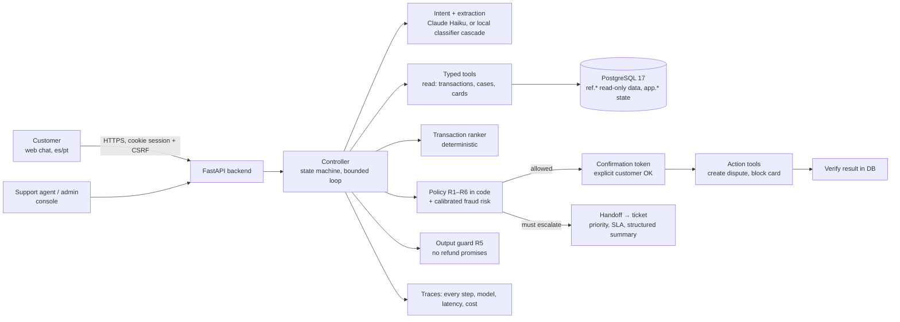

# Unrecognized-charge disputes: an AI-first banking support agent

Team Gomez · **Factored AI & Data Hackathon 2026** · product name in the demo: *BankyFicticious* (a fictitious bank).

> A customer sees a charge they do not recognize. The assistant finds the charge in their real transaction history, asks
> only when it has to, applies explicit bank policy in code, and either opens a dispute (after an explicit confirmation) or
> hands the case to a human with a structured summary. It works in Spanish and Portuguese, and it **never approves a refund**.

Most of the detailed documentation under [docs/](docs/README.md) is written in Spanish (the team's working language). This
README, the [architecture](docs/architecture.md) and the [decision records](docs/decisions/README.md) are in English.

## What it does

1. **Understands** the complaint and extracts amount, date, merchant and card hints (Claude Haiku, structured output).
2. **Finds and ranks** the customer's candidate transactions with a deterministic ranker, not with the LLM
   ([ADR-0002](docs/decisions/0002-ranker-en-vez-de-llm.md)).
3. **Clarifies** when there is no single clear candidate, in at most 3 rounds
   ([ADR-0005](docs/decisions/0005-maquina-de-estados-con-loop-acotado.md)).
4. **Applies policy in code** (rules R1–R6, [docs/policies.md](docs/policies.md)): dispute window, pending and reversed
   charges, no duplicate disputes, confirm before acting, no refund promises, and fraud-risk bands from a calibrated score.
5. **Acts only after the customer confirms** with a one-time token: opens the dispute or blocks the card, then verifies the
   result against the database before saying it is done.
6. **Escalates** to a human when policy says so (high risk, out of window, clarification exhausted, the customer asks): the
   case becomes a ticket with priority, SLA and a structured handoff (verified facts vs. what the customer claims).

Around that flow: customer history and feedback, an agent ticket inbox, an admin panel (SLOs, latency, cost, logs), an
improvement loop that only proposes changes for human review, and voice behind a feature flag (off by default).

## Demo

| Where | Status |
|---|---|
| Public URL | **Pending: deployment is scheduled for Saturday** (Render; checklist in [docs/deployment.md](docs/deployment.md)) |
| Local, production-like (**the team's only test environment**) | `scripts/prodlike_up.sh` → https://localhost:8443 ([docs/prodlike.md](docs/prodlike.md)) |
| From a clean clone (quick start, see *How to run it*) | `scripts/dev_up.sh --reset-demo` → http://localhost:5173 |

Demo users cover one scenario each (clear charge, similar charges, high risk, out of window, pending, reversed), plus a
support agent and an admin. With `DEMO_MODE=true` the login screen lists them; the password is never shown in the UI.
All customers, cards and transactions are fictitious.

## Architecture



- **The LLM never decides money or policy.** It classifies, extracts and writes short texts; code owns the state machine,
  the policy, the tools and the verification ([docs/architecture.md](docs/architecture.md)).
- **Data:** CSV → DuckDB → PostgreSQL with data contracts, quarantine and lineage. The app connects with least-privilege
  roles; the customer id always comes from the session, never from the conversation.
- **Stack:** Python 3.12, FastAPI, PostgreSQL 17, React + Vite, Claude (Haiku for most nodes, Sonnet for explanations and
  handoff summaries), scikit-learn for the small local models.

## Key decisions

| Decision | Why | Record |
|---|---|---|
| One workflow done well: unrecognized-charge disputes | High volume, clear policy, real risk if done blindly | [ADR-0001](docs/decisions/0001-workflow-disputas.md) |
| Rank candidate transactions with code, not with the LLM | Deterministic, testable, cheap; the LLM never picks the transaction | [ADR-0002](docs/decisions/0002-ranker-en-vez-de-llm.md) |
| Evaluation cases generated over real transactions, plus a hand-written test | Ground truth is known; the frozen test is written by people | [ADR-0003](docs/decisions/0003-reclamos-generados-sobre-transacciones-reales.md) |
| Model per node | Small model where it is enough; larger only where writing quality matters | [ADR-0004](docs/decisions/0004-modelo-por-nodo.md) |
| State machine with a bounded clarification loop | Predictable, auditable, cannot loop forever | [ADR-0005](docs/decisions/0005-maquina-de-estados-con-loop-acotado.md) |
| Templates for confirmations and approved texts for process questions | Nothing the customer must rely on is free LLM text | [docs/policies.md](docs/policies.md) (R4, R5) |
| Every action needs a confirmation token and is verified afterwards | No silent or duplicated actions | [docs/tools-contract.md](docs/tools-contract.md) |

## Results at a glance

Every number comes from a recorded run; the source is linked. "Unsafe" means a forbidden action, another customer's data,
a success claimed without verification, a duplicate dispute, or a refund promise. Cost and latency from `claude -p`
(local CLI) are **not** production figures; the API rows are.

| What | Result | Source |
|---|---|---|
| Rules-only baseline, dev (50 cases) | 50/50 pass, 0/50 unsafe, 16 / 23 ms per turn (p50 / p95), $0 | [comparison 2026-09-30](eval/results/20260930-2139_comparacion_dev.md) |
| All-LLM variant (`claude -p`), dev, 3 repeats | 150/150 pass, 0/150 unsafe, 7.5 / 19.8 s, $0.0218 per case | same |
| System (`claude -p`), dev, 3 repeats | 150/150 pass, 0/150 unsafe, 3.9 / 13.0 s, $0.0151 per case | same |
| **System with the Claude API**, dev (60 cases) | **60/60 pass, 0/60 unsafe, 1.5 / 4.6 s, $0.0079 per case** | [checkpoint 1](docs/llm-data.md) |
| System with the Claude API, paraphrased dev (98) | 96/98 pass, 1/98 unsafe (fixed afterwards, see below), 1.4 / 5.2 s, $0.0073 | [checkpoint 1](docs/llm-data.md) |
| System with the API after the fix, dev (81) and paraphrased dev (96) | 81/81 and 96/96 pass, 0 unsafe, $0.0072 and $0.0073 per case | [dev](eval/results/20261001-1601_comparacion_dev.md), [paraphrase](eval/results/20261001-1601_comparacion_dev_paraphrase.md) |
| Intent cascade (local classifier first, LLM only when unsure), 5-fold cross-validation | Same accuracy as Haiku alone (183/187) with 26/187 (13.9 %) of turns reaching the LLM | [experiment](docs/experiments/EXP-20261001-intent-cascade.md) |
| Intent cascade in the harness (API) | Same pass rate, cost per case $0.0072 → $0.0044; latency not improved. Dev is contaminated for the cascade (trained on dev phrasings) | same |
| Fraud risk `risk-v1` (calibrated score, cost-based threshold), held-out period | Flags 446/620 frauds that have a score, precision 446/446; the previous band (score ≥ 70) caught 182/620 | [experiment](docs/experiments/EXP-20261001-risk-calibration.md), [model card](docs/ml/fraud-risk.md) |
| Model for transactions without a score | Not better than chance (ROC-AUC 0.51); **not integrated** | [model card](docs/ml/fraud-risk.md) |
| Local close-out, dev (102 cases at the time; 129 today): baseline, system, system + cascade (`claude -p`) | 102/102 pass, 0/102 unsafe in all three | [docs/evaluation.md](docs/evaluation.md) |
| Security finding from the evaluation | A free-text field written by the intent node (`tema`) reached the customer without the refund-promise guard, so a prompt injection produced "for refund approval, use…". Fixed: approved text only, guard on every LLM-written field, three permanent regression cases | [docs/security.md](docs/security.md) |
| Team lead's review of the chat (2026-10-02): ask before searching, show only matching charges, typo-tolerant routing | Same cases and checkers before → after, fake LLM: dev 110/129 → 129/129; paraphrased dev 78/96 → 93/96; noisy dev (typos) 58/118 → 102/118; unsafe 0 / 0 / 1 → 0. Real-LLM sample of 30: 28/30, 0 unsafe on the first pass | [docs/evaluation.md](docs/evaluation.md) |
| Bug found by the production-like smoke test | "No reconozco el cargo…" after "anything else?" was read as "no, thanks" and closed the conversation. Fixed, with regression cases | [CHANGELOG](CHANGELOG.md) |

### Final evaluation with the Claude API (2026-10-03)

Run with `scripts/final_eval.sh --final` on commit `c4ad373` (the deployed version at the time), real data, a separate
evaluation database, 1 repeat. Source: [eval/results/20261003-1157_tabla_final.md](eval/results/20261003-1157_tabla_final.md).

| Split | Variant | Pass all checks | Unsafe | Latency per turn p50 / p95 | Cost per case |
|---|---|---|---|---|---|
| dev (131) | rules-only baseline | 131/131 | 0/131 | 18 ms / 28 ms | $0 |
| dev (131) | system (API) | 129/131 | 0/131 | 1.4 s / 3.1 s | $0.0071 |
| dev (131) | **system + intent cascade (API)** | **131/131** | **0/131** | **1.2 s / 2.8 s** | **$0.0046** |
| paraphrased dev (96) | rules-only baseline | 93/96 | 0/96 | 19 ms / 28 ms | $0 |
| paraphrased dev (96) | system (API) | 96/96 | 0/96 | 1.6 s / 4.0 s | $0.0075 |
| paraphrased dev (96) | **system + intent cascade (API)** | **96/96** | **0/96** | **1.3 s / 3.8 s** | **$0.0047** |
| hand-written test (frozen) | — | not run: the set was not delivered | | | |

- The two system failures in dev are a checker false positive on a mixed message (fixed afterwards in the checker) and
  a resumed claim that showed a list instead of going straight to the charge (not unsafe).
- The all-LLM variant was not re-run with the API to save credit; it was measured with the local CLI (table above).
- Failed LLM calls stayed under 1.3 % in every run. One run hung for an hour waiting for an API response and was re-run.

## How to run it

Requirements: Docker running, Python 3.12 and Node 22.

```bash
git clone <repo> && cd <repo>
# optional: copy the challenge dataset to dataset/data/ (not versioned). Without it a synthetic dataset is used.
scripts/dev_up.sh --reset-demo
```

That single command creates `.env` with generated passwords, the virtualenv, PostgreSQL 17 in Docker, the schema, the data
and the demo users, and starts the backend (http://127.0.0.1:8000) and the frontend (http://localhost:5173). Each step is
skipped if already done. With the Claude Code CLI installed it uses `claude -p`; without it, it starts with a fake LLM
(rules and templates). The demo password is `DEMO_PASSWORD` in `.env`.

Measured on a clean clone with warm package caches (2026-10-01): **53 s** with the synthetic dataset, **3 min 43 s** with
the challenge dataset (4.4 M transactions), about 4 s on later starts.

```bash
LLM_PROVIDER=fake scripts/dev_up.sh        # no LLM
scripts/prodlike_up.sh                     # production-like: prod settings, built frontend behind one TLS origin
scripts/prodlike_smoke.sh --image          # HTTP smoke test + production Docker image check
```

Tests and evaluation:

```bash
.venv/bin/ruff check backend eval scripts data_pipeline && .venv/bin/mypy backend/app
.venv/bin/python -m pytest -q backend data_pipeline eval/tests
.venv/bin/python -m eval.run --split dev --variant baseline --repeats 1                         # harness
.venv/bin/python -m eval.run --split dev --variant sistema --repeats 1 --set LLM_PROVIDER=fake
scripts/final_eval.sh                      # rehearsal of the final evaluation (fake LLM, dev only)
```

CI runs on every pull request: secret scan (gitleaks, full history), lint and types, tests against PostgreSQL, the dev
harness with a fake LLM on a **synthetic** dataset with a quality gate (0 unsafe results, no regression), and the frontend
checks. Details: [docs/ci.md](docs/ci.md).

| Environment | `LLM_PROVIDER` | Models | Key |
|---|---|---|---|
| Local development | `claude_cli` (`claude -p`, Claude Code subscription) | aliases per node (`haiku`, `sonnet`) | none |
| Tests and CI | `fake` (no network; rules and templates) | — | none |
| Deployed, final evaluation | `anthropic_api` (official SDK) | pinned ids per node (`claude-haiku-4-5-20251001`, `claude-sonnet-5-5`) | `ANTHROPIC_API_KEY`, only as a secret of the host |

## Limitations

- **One workflow.** Anything outside disputes, movements, claim status and card blocking is redirected to the bank's site.
- **Policies are team assumptions**, not the bank's (dispute window, risk bands, SLAs, FAQ texts). Each is marked as such
  and listed in [docs/open-questions.md](docs/open-questions.md).
- **Synthetic data.** The fraud score behaves almost like a step function in this dataset; the calibrated threshold would
  need to be re-fitted on real data. 20 % of transactions have no score and stay in an "unknown" band.
- **The dev split no longer separates variants** (all pass); the frozen hand-written test and the final API run are the
  numbers that matter and are still pending. With the fake LLM (rules only), 16 of 118 typo cases still fail: process
  questions and movement queries with typos need the real model.
- **Single instance.** Rate limits, turn phases and the log buffer live in process memory; more instances would need Redis.
- **Voice** is implemented behind a flag with mocked tests only; it has not been run against the real provider.
- **No real refund, chargeback or card network integration**: the system opens and routes cases; people resolve them.
- Latency and cost measured with `claude -p` are not production figures.

## Repository map

| Folder | Contents |
|---|---|
| [backend/](backend/README.md) | FastAPI API, controller (state machine), LLM nodes, tools, policy, persistence |
| [frontend/](frontend/README.md) | Customer chat, history, agent portal, admin panel |
| [data_pipeline/](data_pipeline/README.md) | ETL from CSV to PostgreSQL, data contracts, validation |
| [ml/](ml/README.md), `models/` | Intent classifier, fraud-risk calibration, ranker experiments; small versioned artifacts |
| [eval/](eval/README.md) | Evaluation harness, cases, checkers, results |
| [analytics/](analytics/README.md) | Demand, data quality and ROI analysis |
| [infra/](infra/README.md), [scripts/](scripts/README.md) | Docker, deployment scripts, local environments |
| [docs/](docs/README.md) | Architecture, flow, contracts, policies, security, evaluation, decisions |

More: [API contract](docs/api-contract.md) · [conversation flow](docs/conversation-flow.md) ·
[security](docs/security.md) · [deployment](docs/deployment.md) · [evaluation](docs/evaluation.md) · [status](docs/STATUS.md) ·
[changelog](CHANGELOG.md) · [contributing](CONTRIBUTING.md).

## Team

| Role | Responsibilities |
|---|---|
| Data scientist | LLM prompts and model per node, evaluation harness, models |
| Data analyst | Data quality, demand analysis, ROI, hand-written test set |
| Software developer | Backend, frontend, deployment |
