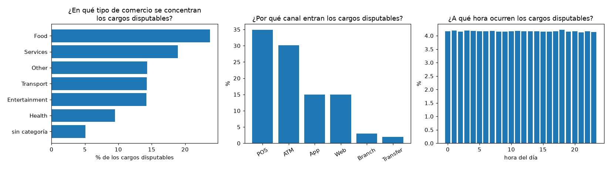
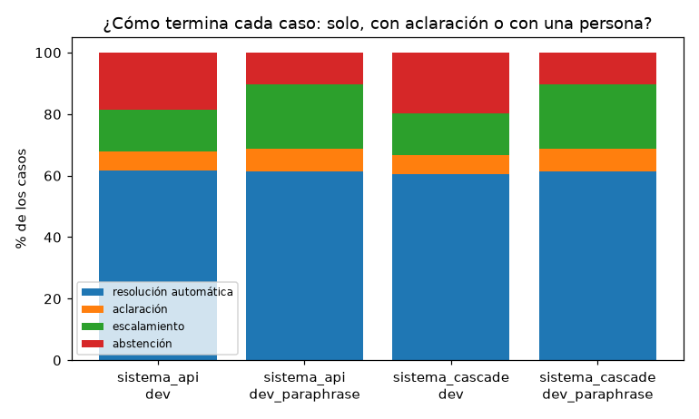
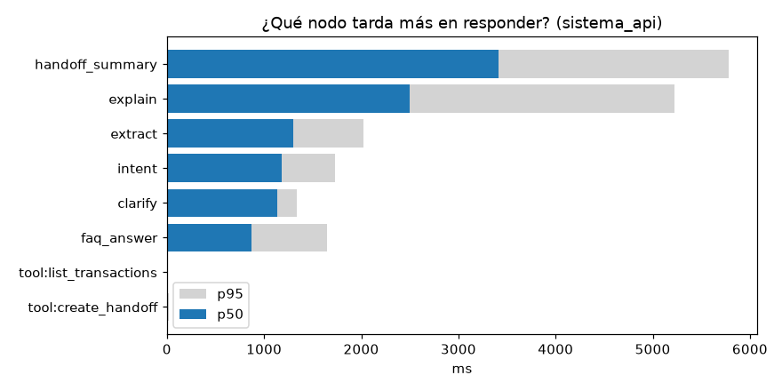
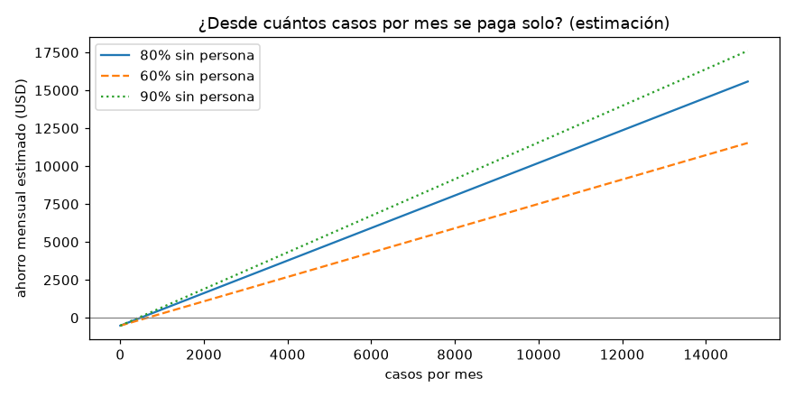

# Analítica operativa

Generado por `python -m analytics.report` el 2026-10-01. Regenera este documento y sus figuras; el notebook `analysis/analytics.ipynb` llama a las mismas funciones. Solo preguntas operativas: cada figura responde la pregunta de su título.

- Mediciones del dataset y de las corridas de evaluación: **medido**. ROI: **estimación** con supuestos.
- Endpoints para el panel: `/api/admin/metrics/operations`, `/latency` y `/roi` ([api-contract.md](api-contract.md)).

## 1. Calidad de datos (reporte del ETL)

Fuente: la base DuckDB del pipeline (`raw_*` → tablas limpias) y los contratos de `data_pipeline/contracts/`. Cada problema tiene la regla del contrato que se le aplica: `block` manda la fila a cuarentena (`ref.rejected_rows`), `warn` la deja pasar y la cuenta.

| Tabla | Filas crudas | Filas limpias | PK duplicadas (crudo) | Filas a cuarentena | Advertencias |
|---|---|---|---|---|---|
| `customers` | 150.000 | 150.000 | 0 | 0 | 0 |
| `products` | 400.000 | 400.000 | 0 | 0 | 12 |
| `transactions` | 4.425.008 | 4.425.008 | 0 | 0 | 0 |
| `daily_exchange_rates` | 13.164 | 13.164 | 0 | 0 | 0 |

**Reglas con filas afectadas** (las demás reglas de los contratos dieron 0):

| Tabla | Regla del contrato | Tipo | Severidad | Filas | Por qué |
|---|---|---|---|---|---|
| `products` | `product_number_unique` | unique | warn | 12 | el diccionario dice UNIQUE pero el dataset trae 6 repetidos (H14) |

Reglas evaluadas: 57 (not_null, dominios, rangos, unicidad e integridad referencial).

**Nulos que importan para el flujo de disputas** (`transactions`):

| Columna | Nulos | Qué implica |
|---|---|---|
| `fraud_score` | 885.157/4.425.008 (20.0 %) | riesgo `desconocido` (R6): no se trata como bajo |
| `merchant_name` | 3.395.774/4.425.008 (76.7 %) | no se puede identificar por comercio; no es un cargo disputable por este canal |
| `amount_usd` | 2.537.456/4.425.008 (57.3 %) | se completa con la tasa del día en `amount_usd_filled` |
| `amount_usd_filled` | 0/4.425.008 (0.0 %) | monto en USD ya completado: es el que usa el umbral de autoservicio de R6 |

**Rangos y tipos:**

- Montos ≤ 0: 0. `fraud_score` fuera de 0–100: 0. Movimientos con fecha más de 2 días después de su partición: 0.
- Valores que no se pudieron convertir al tipo del diccionario: 0 (93 columnas con tipo revisadas, tabla `cast_failures`).
- Archivos leídos: 7.671 CSV, 23.495.188 filas; filas rechazadas al leer: 0; archivos con error: 0.

**Claves huérfanas** (las tres dan 0 en la carga completa): transacciones con producto inexistente, productos sin cliente y transacciones cuyo cliente no es el dueño del producto. La última es la que rompería el aislamiento por cliente.

**Frescura:** última partición `process_date` = 2026-06-17; último movimiento = 2026-06-18 05:59; base construida el 2026-09-30 22:18. El chat muestra al cliente "datos actualizados al…" con esa fecha.

## 2. Demanda (desde el dataset)

El dataset no tiene disputas etiquetadas por movimiento, así que se mira el universo de **cargos disputables por este canal**: compras con comercio (1.029.234/4.425.008 (23.3 %) de los movimientos). Es un proxy de dónde pueden aparecer las disputas, no un conteo de disputas.

- **¿Dónde se concentran?** La categoría con más cargos disputables es `Food` (243.993/1.029.234 (23.7 %)); la distribución entre categorías es bastante pareja (7 categorías, la menor con 51.952/1.029.234 (5.0 %)). Canal principal: `POS` (359.493/1.029.234 (34.9 %)).
- **¿Qué tan frecuentes son los cargos parecidos?** En una muestra del 5 % de los clientes (48.487 cargos aprobados), 3.305/48.487 (6.8 %) tienen otro cargo del mismo cliente con monto a ±10 % en ±30 días, y 2/48.487 (0.0 %) tienen otro con el **mismo** monto. Son los casos en que el monto no alcanza para identificar el cargo y el asistente tiene que aclarar (lista de candidatas, máximo 3 vueltas).
- **¿Qué proporción queda pendiente?** 88.343/4.425.008 (2.0 %) de los movimientos están en estado `Pending` (R2: se informa, no se abre el reclamo formal; R2b: si el cliente afirma que no lo hizo, va al equipo de fraude). Estados: `Approved` 4.070.681/4.425.008 (92.0 %), `Declined` 221.234/4.425.008 (5.0 %), `Pending` 88.343/4.425.008 (2.0 %), `Reversed` 44.750/4.425.008 (1.0 %).
- **Reclamos registrados en el dataset** (`complaints`, tipo `Claim`): 16.598; por categoría: Fees 3.357/16.598 (20.2 %), Branch 3.355/16.598 (20.2 %), Transactions 3.335/16.598 (20.1 %), Technical 3.312/16.598 (20.0 %), Service 3.239/16.598 (19.5 %). Sus descripciones son de plantilla, así que no se usan como texto.

## 3. Operación (desde las trazas de las corridas de evaluación)

Fuente: los crudos del harness (`eval/results/raw/`, fuera de git) de la última corrida de cada variante. Son casos de evaluación, no tráfico real: describen cómo se comporta el sistema ante los escenarios del set, no la mezcla de producción.

| Variante | Split | Casos | Resolución automática | Aclaración | Escalamiento | Abstención | Pasan todo | Costo por caso correctamente atendido |
|---|---|---|---|---|---|---|---|---|
| `sistema_api` | dev | 81 | 50/81 (61.7 %) | 5/81 (6.2 %) | 11/81 (13.6 %) | 15/81 (18.5 %) | 81/81 (100.0 %) | $0.0072 |
| `sistema_api` | dev_paraphrase | 96 | 59/96 (61.5 %) | 7/96 (7.3 %) | 20/96 (20.8 %) | 10/96 (10.4 %) | 96/96 (100.0 %) | $0.0073 |
| `sistema_cascade` | dev | 81 | 49/81 (60.5 %) | 5/81 (6.2 %) | 11/81 (13.6 %) | 16/81 (19.8 %) | 81/81 (100.0 %) | $0.0044 |
| `sistema_cascade` | dev_paraphrase | 96 | 59/96 (61.5 %) | 7/96 (7.3 %) | 20/96 (20.8 %) | 10/96 (10.4 %) | 96/96 (100.0 %) | $0.0046 |

Crudos usados: `20261001-1529_sistema_api_dev.json`, `20261001-1537_sistema_api_dev_paraphrase.json`, `20261001-1553_sistema_cascade_dev.json`, `20261001-1601_sistema_cascade_dev_paraphrase.json`.

**Latencia por nodo** (llamadas al LLM y tools, en las corridas con la API real):

| Variante | Nodo | Llamadas | p50 | p95 |
|---|---|---|---|---|
| `sistema_api` | `handoff_summary` | 34 | 3410 ms | 5785 ms |
| `sistema_api` | `explain` | 92 | 2495 ms | 5221 ms |
| `sistema_api` | `extract` | 194 | 1296 ms | 2026 ms |
| `sistema_api` | `intent` | 187 | 1185 ms | 1732 ms |
| `sistema_api` | `clarify` | 6 | 1140 ms | 1338 ms |
| `sistema_api` | `faq_answer` | 9 | 869 ms | 1645 ms |
| `sistema_api` | `tool:list_transactions` | 13 | 12 ms | 14 ms |
| `sistema_api` | `tool:create_handoff` | 34 | 12 ms | 17 ms |
| `sistema_api` | `tool:list_cards` | 11 | 8 ms | 14 ms |
| `sistema_api` | `tool:list_cases` | 1 | 7 ms | 7 ms |
| `sistema_api` | `tool:search_transactions` | 134 | 6 ms | 11 ms |
| `sistema_api` | `tool:lock_card` | 20 | 5 ms | 9 ms |
| `sistema_api` | `tool:create_dispute_case` | 81 | 4 ms | 9 ms |
| `sistema_api` | `tool:get_card_status` | 33 | 3 ms | 11 ms |
| `sistema_api` | `tool:get_handoff` | 34 | 3 ms | 6 ms |
| `sistema_api` | `tool:get_existing_case` | 207 | 2 ms | 3 ms |
| `sistema_api` | `tool:get_transaction` | 220 | 1 ms | 4 ms |
| `sistema_api` | `tool:get_case` | 75 | 1 ms | 2 ms |
| `sistema_cascade` | `handoff_summary` | 34 | 3682 ms | 7098 ms |
| `sistema_cascade` | `explain` | 92 | 2354 ms | 5363 ms |
| `sistema_cascade` | `clarify` | 6 | 1444 ms | 1811 ms |
| `sistema_cascade` | `extract` | 168 | 1319 ms | 2040 ms |
| `sistema_cascade` | `intent` | 23 | 1318 ms | 2123 ms |
| `sistema_cascade` | `faq_answer` | 9 | 873 ms | 1279 ms |
| `sistema_cascade` | `tool:list_transactions` | 13 | 13 ms | 17 ms |
| `sistema_cascade` | `tool:create_handoff` | 34 | 12 ms | 17 ms |
| `sistema_cascade` | `tool:search_transactions` | 134 | 8 ms | 12 ms |
| `sistema_cascade` | `tool:list_cards` | 11 | 8 ms | 12 ms |
| `sistema_cascade` | `tool:create_dispute_case` | 81 | 5 ms | 8 ms |
| `sistema_cascade` | `tool:lock_card` | 20 | 4 ms | 14 ms |
| `sistema_cascade` | `tool:get_handoff` | 34 | 4 ms | 7 ms |
| `sistema_cascade` | `tool:get_existing_case` | 207 | 3 ms | 5 ms |
| `sistema_cascade` | `tool:get_card_status` | 33 | 3 ms | 7 ms |
| `sistema_cascade` | `tool:get_transaction` | 220 | 2 ms | 4 ms |
| `sistema_cascade` | `tool:get_case` | 75 | 2 ms | 4 ms |

## 4. ROI (estimación con supuestos explícitos)

**Esto es una estimación, no un resultado.** Los supuestos están en `backend/config/roi.toml`, son del equipo y se pueden editar; el endpoint `/api/admin/metrics/roi` devuelve los mismos números.

| Supuesto | Valor | Origen |
|---|---|---|
| Costo de una persona por minuto | $0.25 | supuesto del equipo |
| Minutos por caso atendido por una persona | 5.4 | medido en el dataset (duración media de `call_center_interactions`) |
| Casos por mes | 10.000 | supuesto del equipo |
| Casos que no pasan a una persona | 80% | supuesto, apoyado en la contención medida en dev (70/81 (86.4 %)) |
| Costo de LLM por caso | $0.0072 | medido (`sistema_api`): $0.0072 en la última corrida |
| Costo fijo mensual | $513.30 | hosting de la demo + mantenimiento estimado |

- Costo de un caso atendido por una persona: **$1.35**.
- Ahorro estimado por caso (incluye el costo de LLM de los casos que igual pasan a una persona): **$1.07**.
- Ahorro mensual estimado con 10.000 casos: **$10.215**.
- **Punto de equilibrio:** 478 casos por mes.

Lo que este cálculo **no** incluye: el costo de construir y evaluar el sistema, el de los casos que el asistente atiende mal (se miden en la evaluación, no en dinero) y el efecto en la satisfacción del cliente.

