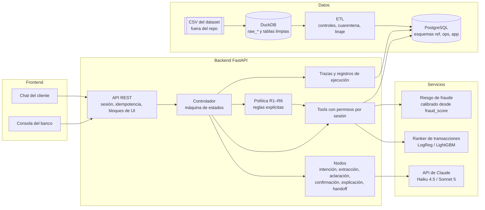

# Arquitectura

Estado: **[Propuesta]** basada en decisiones ya tomadas por el equipo. No hay código todavía.

## Qué pide el reto

**[Oficial]** Del enunciado y el kickoff:

- Un sistema que haga **Entender → Decidir → Actuar → Verificar → Escalar**, no un chatbot.
- Mantener contexto, aclarar ambigüedad y responder solo con información permitida de cuentas, transacciones o políticas.
- Usar tools cuando sirvan al flujo y **reportar solo acciones cuyo resultado se verificó**.
- **Aplicar permisos y políticas fuera del texto generado por el modelo.**
- Autenticación con una sesión o servicio de identidad de prueba confiable; un número de documento o de cliente por sí solo no prueba identidad.
- Controlar el acceso a los registros de cada cliente en la capa de servicio o de tools.
- Trazabilidad, reintentos acotados, fallback seguro y setup reproducible. La cadena de pensamiento oculta del modelo **no** es un artefacto de auditoría.
- Justificar dónde la IA es apropiada y dónde es preferible la lógica determinista.

## Componentes

**[Decisión]** Frontend → API FastAPI → controlador con máquina de estados → tools con permisos por sesión → política con reglas explícitas. Servicios: API de Claude, ranker de transacciones, riesgo de fraude calibrado y PostgreSQL alimentado por un ETL.

### Responsabilidades

| Componente | Responsabilidad | Carpeta |
|---|---|---|
| Chat del cliente | Envía mensajes y acciones (elegir candidata, confirmar, pedir humano); renderiza bloques de UI. No decide nada. | [frontend/customer_chat/](../frontend/customer_chat/README.md) |
| Consola del banco | Lista reclamos y handoffs, muestra trazas por turno. Solo lectura. | [frontend/bank_console/](../frontend/bank_console/README.md) |
| API | Autentica la sesión, aplica Idempotency-Key, valida esquemas y devuelve bloques. Ver [api-contract.md](api-contract.md). | [backend/api/](../backend/api/README.md) |
| Controlador | Único dueño del estado de la conversación. Decide el siguiente nodo con reglas, cuenta vueltas de aclaración, aplica timeouts y reintentos. | [backend/controller/](../backend/controller/README.md) |
| Nodos | Unidades de trabajo del flujo. Algunos llaman al LLM, otros son deterministas. Ver [conversation-flow.md](conversation-flow.md). | [backend/nodes/](../backend/nodes/README.md) |
| Tools | Acceso a datos y acciones. Inyectan el `customer_id` desde la sesión, nunca desde el modelo. Ver [tools-contract.md](tools-contract.md). | [backend/tools/](../backend/tools/README.md) |
| Política | Evalúa R1–R6 y devuelve permitido/denegado/escalar con la regla que aplicó. Ver [policies.md](policies.md). | [backend/policy/](../backend/policy/README.md) |
| Persistencia | Conversaciones, turnos, reclamos, handoffs, trazas, claves de idempotencia, tokens de confirmación. | [backend/persistence/](../backend/persistence/README.md) |
| Cliente LLM | Llamadas a Claude con prompts versionados, salidas con esquema, reintentos acotados y registro de tokens y costo. | [backend/llm/](../backend/llm/README.md) |
| Ranker | Ordena transacciones candidatas y da un score por candidata. Ver [ml/ranker.md](ml/ranker.md). | [ml/ranker/](../ml/ranker/README.md) |
| Riesgo de fraude | Probabilidad calibrada y banda de riesgo a partir de `fraud_score`. Ver [ml/fraud-risk.md](ml/fraud-risk.md). | [ml/fraud_risk/](../ml/fraud_risk/README.md) |
| ETL | CSV → DuckDB (capa raw `raw_<tabla>` y capa limpia) → PostgreSQL `ref`, con controles, cuarentena, linaje en `ops` y carga incremental. Ver [data/postgres.md](data/postgres.md). | [data_pipeline/](../data_pipeline/README.md) |

### Capas de datos

**[Decisión]** El recorrido raw → limpio → servido sigue visible, repartido en dos motores:

| Capa | Motor | Esquema / tablas | Ciclo de vida |
|---|---|---|---|
| raw | DuckDB | `raw_<tabla>`: CSV tal cual + `source_file`, `partition_date` | Se reconstruye desde los CSV. |
| limpia | DuckDB | `<tabla>`: tipada, deduplicada, enriquecida (las 13 tablas; análisis y ML) | Se reconstruye desde raw. |
| servida | PostgreSQL | `ref`: customers, products, transactions, daily_exchange_rates | La recarga el ETL. |
| linaje | PostgreSQL | `ops`: etl_runs, etl_files | Nunca se trunca. |
| aplicación | PostgreSQL | `app`: sesiones, conversaciones, reclamos, handoffs, trazas… | La recarga de `ref` nunca la toca (sin FK hacia `ref`). |

Detalle en [data/postgres.md](data/postgres.md).

## Quién hace qué: LLM, ML y código determinista

**[Decisión]** Principio: el LLM interpreta y redacta; el ML ordena y estima; el código decide y actúa.

| Tarea | Quién | Por qué |
|---|---|---|
| Detectar intención e idioma (es/pt) | LLM (Haiku 4.5), con baseline de reglas y clasificador clásico ([ml/intent-classifier.md](ml/intent-classifier.md)) | Lenguaje libre y multilingüe; no hay etiquetas de intención útiles en el dataset. |
| Extraer monto, moneda, fecha, comercio, canal | LLM (Haiku 4.5) con salida validada por esquema | "El cobro de 120 del martes en el súper" requiere interpretar lenguaje. El resultado se valida en código. |
| Buscar e identificar la transacción | Consulta SQL + **ranker de ML** | Es un problema de ranking con etiquetas construibles; es medible, barato y no alucina IDs ([ADR-0002](decisions/0002-ranker-en-vez-de-llm.md)). |
| Decidir si la candidata es "clara" | Código (umbral sobre el score del ranker) | Umbral explícito y auditable. |
| Redactar preguntas de aclaración | LLM (Haiku 4.5) | Redacción natural en el idioma del cliente, a partir de candidatas ya elegidas por el código. |
| Contar vueltas de aclaración (máx. 3) | Código (controlador) | Límite duro, no negociable por el modelo ([ADR-0005](decisions/0005-maquina-de-estados-con-loop-acotado.md)). |
| Estimar riesgo de fraude | **ML** (calibración de `fraud_score`) | Única señal con poder predictivo medido en el dataset (AUC 0,847). |
| Aplicar políticas R1–R6 | Código | **[Oficial]** Permisos y políticas fuera del texto del modelo. |
| Emitir y validar `confirmation_token` | Código | El modelo no puede ejecutar una acción sin confirmación real del cliente. |
| Crear reclamo, bloquear tarjeta | Tools (código) | Solo con token válido y política aprobada. |
| Verificar que la acción ocurrió | Código (tool de lectura después de escribir) | **[Oficial]** Reportar solo acciones verificadas. |
| Explicar el resultado al cliente | LLM (Sonnet 5), con los hechos y reglas ya decididos como entrada | Explicación clara basada en fuentes y reglas, no en razonamiento oculto. |
| Resumir el handoff | LLM (Sonnet 5) para el resumen; el resto del handoff lo arma el código | Los hechos verificados vienen de tools, no del modelo ([handoff-schema.md](handoff-schema.md)). |

## Flujo de datos de un turno

**[Propuesta]** Ejemplo: "Tengo un cobro de $120 que no reconozco".

1. El chat envía `POST /api/conversations/{id}/turns` con `Authorization` e `Idempotency-Key`.
2. La API valida la sesión (si expiró, devuelve un bloque `error` con `session_expired`) y la clave de idempotencia.
3. El controlador carga el estado (`inicio`) y ejecuta los nodos de intención y extracción: `{intencion: disputa, monto: 120, moneda: null, fecha: null}`.
4. El controlador llama a `search_transactions` con el `customer_id` de la sesión. El tool consulta PostgreSQL y el ranker ordena las candidatas.
5. Si la mejor candidata supera el umbral, el estado pasa a `confirmando_movimiento` y la API devuelve un `transaction_card`; si no, pasa a `aclarando` y devuelve un `candidate_list`.
6. Cada paso escribe una traza: nodo, duración, modelo y versión de prompt, tokens, costo, entradas y salidas de tools (con datos sensibles enmascarados) y reglas de política evaluadas.
7. La consola del banco consulta `GET /api/traces/{turn_id}` para ver ese registro.

## Seguridad y control de acceso

- **[Oficial]** Sesión de prueba confiable.
  - **[Decisión]** Login con usuario y contraseña (`app.users`, argon2id).
  - Cookie httpOnly con vencimiento por inactividad, CSRF de doble envío y límite de intentos por usuario e IP.
  - Roles `customer` y `analyst`.
  - Los usuarios demo son un sandbox documentado ([api-contract.md](api-contract.md#autenticación)).
- **[Decisión]** Tools con permisos por sesión: el `customer_id` se inyecta desde la sesión y cualquier intento de consultar datos de otro cliente devuelve `not_found`.
- **[Propuesta]** Defensa contra prompt injection: el texto del cliente nunca se interpreta como instrucción para tools; las acciones solo se habilitan por el estado de la máquina y por el `confirmation_token`.
- **[Oficial]** No enviar datos privados, credenciales ni datos restringidos a modelos externos. El dataset es sintético; Pendiente confirmar si se permite enviarlo a la API de Claude (P-05).

## Operación

**[Propuesta]** Detalle en [infra/README.md](../infra/README.md):

- Trazas por turno y registros de ejecución persistidos.
- Reintentos acotados (`MAX_RETRIES`) y fallback seguro: si falla un tool o el LLM, el sistema no inventa, informa y escala.
- Monitoreo de latencia p50/p95, costo por caso y tasa de escalamiento.
- Retención de datos de conversación: Pendiente (P-20).
- Límites de capacidad: Pendiente, se medirán con el harness (P-06).
