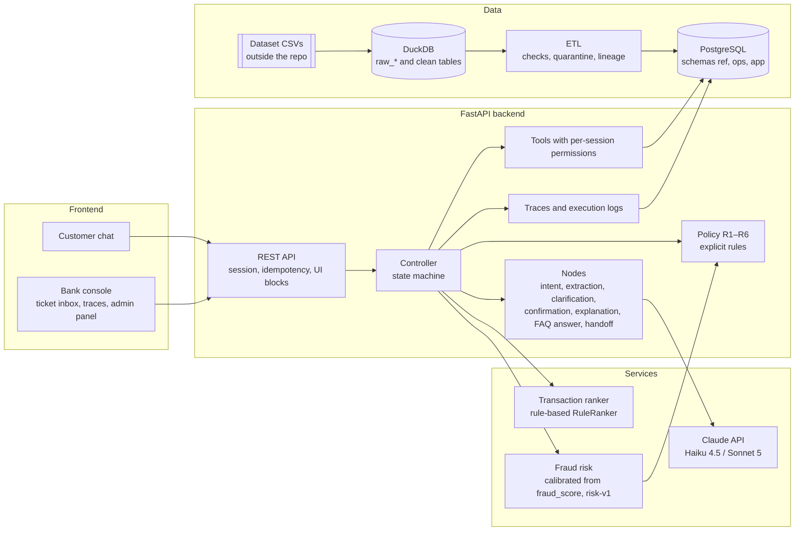

# Architecture

Status (2026-10-02): **implemented**. This document describes the code in `main`; the labels **[Official]**, **[Decision]**, **[Proposal]** and **[Assumption]** say where each statement comes from. Day-to-day progress is in [STATUS.md](STATUS.md).

## What the challenge asks for

**[Official]** From the challenge statement and the kickoff:

- A system that does **Understand → Decide → Act → Verify → Escalate**, not a chatbot.
- Keep context, clarify ambiguity and answer only with permitted information about accounts, transactions or policies.
- Use tools when they serve the flow and **report only actions whose result was verified**.
- **Enforce permissions and policies outside the text generated by the model.**
- Authentication with a trusted test session or identity service; a document number or customer number alone does not prove identity.
- Control access to each customer's records in the service or tools layer.
- Traceability, bounded retries, safe fallback and reproducible setup. The model's hidden chain of thought is **not** an audit artifact.
- Justify where AI is appropriate and where deterministic logic is preferable.

## Components

**[Decision]** Frontend → FastAPI API → controller with a state machine → tools with per-session permissions → policy with explicit rules. Services: Claude API, transaction ranker, calibrated fraud risk and PostgreSQL fed by an ETL.

### Responsibilities

The "Folder" column links to the README that documents each component. The backend code itself lives under `backend/app/` (`controller/`, `llm/`, `ml/`, `policy/`, `tools/`, `auth/`, `protection/`, `observability/`).

| Component | Responsibility | Folder |
|---|---|---|
| Customer chat | Sends messages and actions (pick a candidate, confirm, ask for a human); renders UI blocks. Decides nothing. | [frontend/customer_chat/](../frontend/customer_chat/README.md) |
| Bank console | Lists cases and handoffs and shows per-turn traces. Support agents (`analyst`) work the ticket inbox (assign, change status, add notes); the `admin` role sees SLOs, metrics and logs. | [frontend/bank_console/](../frontend/bank_console/README.md) |
| API | Authenticates the session, applies Idempotency-Key, validates schemas and returns blocks. See [api-contract.md](api-contract.md). | [backend/api/](../backend/api/README.md) |
| Controller | Sole owner of the conversation state. Decides the next node with rules, counts clarification rounds, applies timeouts and retries. | [backend/controller/](../backend/controller/README.md) |
| Nodes | Units of work in the flow. Some call the LLM, others are deterministic. See [conversation-flow.md](conversation-flow.md). | [backend/nodes/](../backend/nodes/README.md) |
| Tools | Data access and actions. They inject the `customer_id` from the session, never from the model. See [tools-contract.md](tools-contract.md). | [backend/tools/](../backend/tools/README.md) |
| Policy | Evaluates R1–R6 and returns allow/deny/escalate with the rule that applied. See [policies.md](policies.md). | [backend/policy/](../backend/policy/README.md) |
| Persistence | Conversations, turns, cases, handoffs, traces, idempotency keys, confirmation tokens. | [backend/persistence/](../backend/persistence/README.md) |
| LLM client | Calls to Claude with versioned prompts, schema-validated outputs, bounded retries and a record of tokens and cost. Interchangeable providers behind `LLMClient`: `anthropic_api` (production, official SDK, fixed IDs per node, [llm-data.md](llm-data.md#proveedor-de-producción-api-de-claude-prompt-05-fase-1)), `claude_cli` (development) and `fake` (tests, and the default when nothing is set). | [backend/llm/](../backend/llm/README.md) |
| Ranker | Orders candidate transactions and gives a score per candidate. See [ml/ranker.md](ml/ranker.md). | [ml/ranker/](../ml/ranker/README.md) |
| Fraud risk | Calibrated probability and risk band derived from `fraud_score`. See [ml/fraud-risk.md](ml/fraud-risk.md). | [ml/fraud_risk/](../ml/fraud_risk/README.md) |
| ETL | CSV → DuckDB (raw layer `raw_<table>` and clean layer) → PostgreSQL `ref`, with checks, quarantine, lineage in `ops` and incremental load. See [data/postgres.md](data/postgres.md). | [data_pipeline/](../data_pipeline/README.md) |

### Data layers

**[Decision]** The raw → clean → served path stays visible, split across two engines:

| Layer | Engine | Schema / tables | Lifecycle |
|---|---|---|---|
| raw | DuckDB | `raw_<table>`: CSV as is + `source_file`, `partition_date` | Rebuilt from the CSVs. |
| clean | DuckDB | `<table>`: typed, deduplicated, enriched (all 13 tables; analysis and ML) | Rebuilt from raw. |
| served | PostgreSQL | `ref`: customers, products, transactions, daily_exchange_rates | Reloaded by the ETL. |
| lineage | PostgreSQL | `ops`: etl_runs, etl_files | Never truncated. |
| application | PostgreSQL | `app`: sessions, conversations, cases, handoffs, traces… | The `ref` reload never touches it (no FK to `ref`). |

Details in [data/postgres.md](data/postgres.md).

## Who does what: LLM, ML and deterministic code

**[Decision]** Principle: the LLM interprets and writes; ML ranks and estimates; code decides and acts.

| Task | Who | Why |
|---|---|---|
| Detect intent and language (es/pt) | LLM (Haiku 4.5) in the production configuration (`INTENT_CLASSIFIER=llm`); the repo default is the keyword-rule baseline, and a cascade with a classical classifier (`intent-v1`) is an evaluated variant ([ml/intent-classifier.md](ml/intent-classifier.md)) | Free-form, multilingual language; the dataset has no useful intent labels. |
| Extract amount, currency, date, merchant and card hints | LLM (Haiku 4.5) with schema-validated output | "El cobro de 120 del martes en el súper" (the 120 charge on Tuesday at the supermarket) requires interpreting language. The result is validated in code. |
| Search for and identify the transaction | SQL query + **ranker** (today the rule-based `RuleRanker`, `ranker = "rule"`) | It is a ranking problem with labels that can be built; it is measurable, cheap and does not hallucinate IDs ([ADR-0002](decisions/0002-ranker-en-vez-de-llm.md)). |
| Decide whether the candidate is "clear" | Code (threshold on the ranker score: τ = 0.60, δ = 0.20) | Explicit, auditable threshold. |
| Write clarification questions | Template when the customer picks among 2–3 candidates; LLM (Haiku 4.5) otherwise (`CLARIFY_MODE=auto`) | Natural wording in the customer's language, built from candidates already chosen by code. |
| Count clarification rounds (max. 3) | Code (controller) | Hard limit, not negotiable by the model ([ADR-0005](decisions/0005-maquina-de-estados-con-loop-acotado.md)). |
| Estimate fraud risk | **ML** (calibration of `fraud_score`, `risk-v1`) | The only signal with measured predictive power in the dataset (AUC 0.847). |
| Apply policies R1–R6 | Code | **[Official]** Permissions and policies outside the model's text. |
| Issue and validate `confirmation_token` | Code | The model cannot execute an action without real confirmation from the customer. |
| Create case, lock card | Tools (code) | Only with a valid token and policy approval. |
| Verify that the action happened | Code (read tool after the write) | **[Official]** Report only verified actions. |
| Explain the result to the customer | LLM (Sonnet 5), with the facts and rules already decided as input | Clear explanation based on sources and rules, not on hidden reasoning. |
| Summarize the handoff | LLM (Sonnet 5) for the summary; code assembles the rest of the handoff | Verified facts come from tools, not from the model ([handoff-schema.md](handoff-schema.md)). |

## Data flow of one turn

**[Decision]** Example: "Tengo un cobro de $120 que no reconozco" (I have a $120 charge I don't recognize).

1. The chat sends `POST /api/conversations/{id}/turns` with the session cookie, the CSRF header and `Idempotency-Key`.
2. The API validates the session (if it expired, it returns a 401 error with code `session_expired`) and the idempotency key.
3. The controller loads the state (`inicio`) and runs the intent and extraction nodes in parallel: `{intent: cargo_no_reconocido, amount_hint: {value: 120, currency: null}, date_hint: null}`.
4. The controller calls `search_transactions` with the session's `customer_id`. The tool queries PostgreSQL and the ranker orders the candidates.
5. If the best candidate passes the threshold, the state becomes `confirmando_movimiento` and the API returns a `transaction_card`; otherwise it becomes `aclarando` and returns a `candidate_list`.
6. Each step writes a trace: node, duration, model and prompt version, tokens, cost, tool inputs and outputs (with sensitive data masked) and the policy rules evaluated.
7. The bank console calls `GET /api/traces/{turn_id}` to see that record.

After the customer confirms the charge, the controller evaluates R1–R6 with the risk band, issues a `confirmation_token`, runs the action tool only when the `confirm` action arrives with that token, re-reads what was written and only then returns a `result` block. When policy says escalate (or a tool fails twice, or 3 clarification rounds are used up), it creates a handoff that becomes a ticket in the agents' inbox. Full flow: [conversation-flow.md](conversation-flow.md).

## Security and access control

- **[Official]** Trusted test session.
  - **[Decision]** Login with username and password (`app.users`, argon2id).
  - httpOnly cookie with inactivity expiry, double-submit CSRF and an attempt limit per user and IP.
  - Roles `customer`, `analyst` and `admin`.
  - The demo users are a documented sandbox ([api-contract.md](api-contract.md#autenticación)).
- **[Decision]** Tools with per-session permissions: the `customer_id` is injected from the session and any attempt to query another customer's data returns `not_found`.
- **[Decision]** Defense against prompt injection: the customer's text is never interpreted as an instruction for tools; actions are enabled only by the state of the machine and by the `confirmation_token`.
- **[Official]** Do not send private data, credentials or restricted data to external models. The dataset is synthetic; whether it may be sent to the Claude API is still an open question for the organizers (P-05). **[Assumption]** applied meanwhile: per-node data minimization ([llm-data.md](llm-data.md)).
- **[Decision]** Rate limits per IP and per session (429 + `Retry-After`), a daily LLM budget with a degraded mode, and security headers ([security.md](security.md)).

## Operations

**[Decision]** Details in [infra/README.md](../infra/README.md):

- Per-turn traces persisted in `app.traces`, plus JSON execution logs.
- Bounded retries (`LLM_RETRIES`; one retry for a tool on infrastructure errors) and safe fallback: if a tool or the LLM fails, the system does not make things up; it informs and escalates.
- Monitoring of p50/p95 latency, cost per case and escalation rate (`/api/admin/overview`, `/api/admin/slo`, `/api/admin/metrics/*`).
- Retention of conversation data: pending (P-20).
- Request limits and LLM budget: implemented ([security.md](security.md)); deployment platform: pending (P-06).
