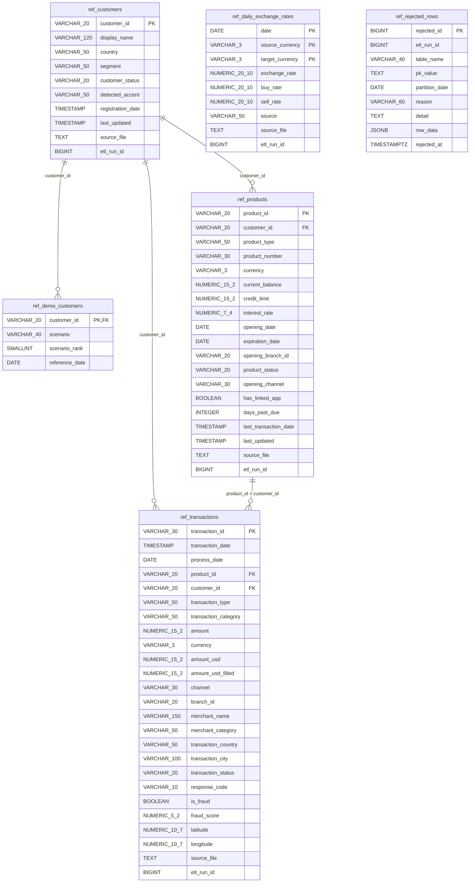
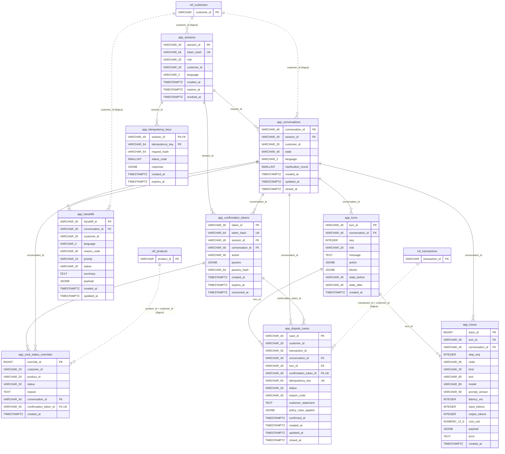
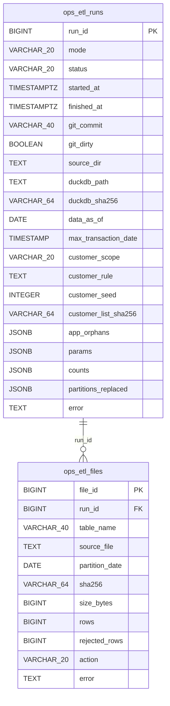

# Esquema de PostgreSQL

Generado por `python -m data_pipeline.quality.schema_doc` a partir de [backend/persistence/models.py](../../backend/persistence/models.py). No editar a mano. Decisiones, cargas y linaje: [postgres.md](postgres.md).

Claves: PK = clave primaria, FK = clave foránea, UK = única. En `app`, las líneas punteadas hacia `ref` son referencias **lógicas sin FK**: una recarga de `ref` no puede borrar ni bloquear el estado de la app. Las valida el chequeo `app_orphans` al final de cada corrida del ETL.

## ref: datos del banco (los recarga el ETL)

## app: estado de la aplicación (una recarga nunca lo toca)

## ops: linaje del ETL (nunca se trunca)

## Índices y consulta que los justifica

Medición con el cliente de más transacciones y caché caliente: [postgres-explain.md](postgres-explain.md). `(customer_id, amount)` se eliminó en la migración 0002 (el índice por fecha ya sirve la búsqueda por monto: 0,054 ms frente a 0,009 ms con el índice propio).

| Esquema | Tabla | Índice / restricción | Columnas | Consulta que lo justifica | Medición |
|---|---|---|---|---|---|
| ref | rejected_rows | `ix_rejected_rows_table_name_reason` | table_name, reason | resumen de la cuarentena por tabla y motivo | no medido (tabla vacía) |
| app | conversations | `ix_conversations_customer_id_created_at` | customer_id, created_at | conversaciones de un cliente (P-26: una nueva por conversación cerrada) | no medido (tabla vacía) |
| app | idempotency_keys | `ix_idempotency_keys_expires_at` | expires_at | purga de claves vencidas (IDEMPOTENCY_TTL_HOURS) | no medido (tabla vacía) |
| ops | etl_files | `ix_etl_files_run_id` | run_id | archivos de una corrida (auditoría del linaje) | no medido |
| ops | etl_files | `ix_etl_files_table_name_source_file` | table_name, source_file | carga incremental: último hash cargado por archivo (pending_files) | no medido |
| ref | products | `ix_products_customer_id` | customer_id | tarjetas del cliente (get_card_status, lock_card) | 0,012 ms · 12 ms |
| ref | products | `uq_products_product_id_customer_id` | product_id, customer_id | destino de la FK compuesta transacción → (producto, dueño) | restricción |
| app | handoffs | `ix_handoffs_status_created_at` | status, created_at | consola: cola de handoffs pendientes | no medido (tabla vacía) |
| ref | transactions | `pk_transactions` | transaction_id | get_transaction / fraud_risk: una transacción por id (más filtro por cliente) | PK |
| ref | transactions | `ix_transactions_process_date` | process_date | carga incremental: DELETE de una partición (process_date) | 1,1 ms · 180 ms |
| ref | transactions | `ix_transactions_product_id` | product_id | historial de una tarjeta (lock_card); soporte de la FK compuesta | 0,015 ms · 92 ms |
| ref | transactions | `ix_transactions_customer_id_transaction_date` | customer_id, transaction_date DESC | search_transactions: ventana de fechas del cliente, más recientes primero; también la búsqueda por monto ±10 % | 0,011 ms con índice · 97 ms sin él |
| app | card_status_overrides | `ix_card_status_overrides_product_id_created_at` | product_id, created_at DESC | get_card_status: override más reciente (vista card_status_effective) | no medido (tabla vacía) |
| app | dispute_cases | `ix_dispute_cases_status_created_at` | status, created_at | consola: GET /api/cases filtrado por estado, más recientes | no medido (tabla vacía) |
| app | dispute_cases | `uq_dispute_cases_open_customer_transaction` | customer_id, transaction_id WHERE status IN ('registrado', 'en_revision') | get_existing_case y R3: un solo reclamo abierto por transacción | restricción |
| app | dispute_cases | `uq_dispute_cases_idempotency_key` | idempotency_key | create_dispute_case idempotente por Idempotency-Key | restricción |

## Política de frescura

Detalle y justificación: [postgres.md](postgres.md#política-de-frescura).

| Qué | Cómo se calcula | Dónde | Para qué |
|---|---|---|---|
| `data_as_of` | máx. `process_date` en `ref.transactions` | `ops.etl_runs.data_as_of` | Particiones completas cargadas; uso interno (linaje, alertas). |
| `max_transaction_date` | máx. `transaction_date` en `ref.transactions` | `ops.etl_runs.max_transaction_date` | **Aviso al cliente**: "movimientos disponibles hasta …". |
| Última carga válida | corrida más reciente con `status` en (`success`, `warning`, `noop`) | `ops.etl_runs.finished_at` | Detectar datos viejos. |
| Horario de carga | **[Supuesto]** incremental diaria a las 07:00 UTC; la partición D se considera completa después de D+1 06:00 (último `transaction_date` posible, H16) | no implementado (sin scheduler) | P-30 en [open-questions.md](../open-questions.md). |
| Umbral de datos viejos | **[Supuesto]** más de 26 h sin carga válida o `data_as_of` < hoy − 2 días | no implementado | Aviso "los datos pueden estar desactualizados" y alerta operativa. |

## Columnas

### `ref.customers`

Clientes, minimizado: nombre visible, país, segmento, estado y acento. Sin documento, contacto, dirección, ciudad, fecha de nacimiento, credit_score ni ingresos (docs/data/postgres.md).

Contrato: [contracts/customers.yaml](../../data_pipeline/contracts/customers.yaml) (v2).

| Columna | Tipo | Nulo | Claves | Comentario |
|---|---|---|---|---|
| `customer_id` | VARCHAR(20) | no | PK |  |
| `display_name` | VARCHAR(120) | no |  | first_name + inicial del apellido ('Samuel Andrés D.'), para el selector de demo. |
| `country` | VARCHAR(50) | no |  | Análisis de disparidades por país. |
| `segment` | VARCHAR(50) | no |  | Comparación por segmento de cliente (lo pide el reto). |
| `customer_status` | VARCHAR(20) | no |  |  |
| `detected_accent` | VARCHAR(50) | sí |  |  |
| `registration_date` | TIMESTAMP WITHOUT TIME ZONE | sí |  |  |
| `last_updated` | TIMESTAMP WITHOUT TIME ZONE | sí |  |  |
| `source_file` | TEXT | no |  |  |
| `etl_run_id` | BIGINT | no |  |  |

### `ref.daily_exchange_rates`

Contrato: [contracts/daily_exchange_rates.yaml](../../data_pipeline/contracts/daily_exchange_rates.yaml) (v1).

| Columna | Tipo | Nulo | Claves | Comentario |
|---|---|---|---|---|
| `date` | DATE | no | PK |  |
| `source_currency` | VARCHAR(3) | no | PK |  |
| `target_currency` | VARCHAR(3) | no | PK |  |
| `exchange_rate` | NUMERIC(20, 10) | no |  |  |
| `buy_rate` | NUMERIC(20, 10) | sí |  |  |
| `sell_rate` | NUMERIC(20, 10) | sí |  |  |
| `source` | VARCHAR(50) | sí |  |  |
| `source_file` | TEXT | no |  |  |
| `etl_run_id` | BIGINT | no |  |  |

### `ref.rejected_rows`

Cuarentena: filas que no cumplen integridad (FK, dueño del producto, partición). Nunca se borran en silencio.

| Columna | Tipo | Nulo | Claves | Comentario |
|---|---|---|---|---|
| `rejected_id` | BIGINT | no | PK |  |
| `etl_run_id` | BIGINT | no |  |  |
| `table_name` | VARCHAR(40) | no |  |  |
| `pk_value` | TEXT | sí |  |  |
| `partition_date` | DATE | sí |  |  |
| `reason` | VARCHAR(60) | no |  |  |
| `detail` | TEXT | sí |  |  |
| `row_data` | JSONB | no |  |  |
| `rejected_at` | TIMESTAMP WITH TIME ZONE | no |  |  |

Índices: `ix_rejected_rows_table_name_reason` (rejected_rows.table_name, rejected_rows.reason)

### `ref.demo_customers`

Clientes de demo elegidos de forma determinista (semilla fija) por escenario; alimenta /api/demo/customers.

| Columna | Tipo | Nulo | Claves | Comentario |
|---|---|---|---|---|
| `customer_id` | VARCHAR(20) | no | PK,FK |  |
| `scenario` | VARCHAR(40) | no |  |  |
| `scenario_rank` | SMALLINT | no |  |  |
| `reference_date` | DATE | no |  |  |

### `ref.products`

Contrato: [contracts/products.yaml](../../data_pipeline/contracts/products.yaml) (v1).

| Columna | Tipo | Nulo | Claves | Comentario |
|---|---|---|---|---|
| `product_id` | VARCHAR(20) | no | PK |  |
| `customer_id` | VARCHAR(20) | no | FK |  |
| `product_type` | VARCHAR(50) | no |  |  |
| `product_number` | VARCHAR(30) | no |  | No es UNIQUE: el dataset trae 6 números repetidos en productos distintos. |
| `currency` | VARCHAR(3) | no |  |  |
| `current_balance` | NUMERIC(15, 2) | sí |  |  |
| `credit_limit` | NUMERIC(15, 2) | sí |  |  |
| `interest_rate` | NUMERIC(7, 4) | sí |  |  |
| `opening_date` | DATE | sí |  |  |
| `expiration_date` | DATE | sí |  |  |
| `opening_branch_id` | VARCHAR(20) | sí |  |  |
| `product_status` | VARCHAR(20) | no |  |  |
| `opening_channel` | VARCHAR(30) | sí |  |  |
| `has_linked_app` | BOOLEAN | sí |  |  |
| `days_past_due` | INTEGER | sí |  |  |
| `last_transaction_date` | TIMESTAMP WITHOUT TIME ZONE | sí |  |  |
| `last_updated` | TIMESTAMP WITHOUT TIME ZONE | sí |  |  |
| `source_file` | TEXT | no |  |  |
| `etl_run_id` | BIGINT | no |  |  |

Índices: `ix_products_customer_id` (products.customer_id)

### `ref.transactions`

Contrato: [contracts/transactions.yaml](../../data_pipeline/contracts/transactions.yaml) (v1).

| Columna | Tipo | Nulo | Claves | Comentario |
|---|---|---|---|---|
| `transaction_id` | VARCHAR(30) | no | PK |  |
| `transaction_date` | TIMESTAMP WITHOUT TIME ZONE | no |  | Tal como viene (sin zona). Evidencia: siempre 6–30 h después de process_date → UTC con día hábil en UTC-6. |
| `process_date` | DATE | no |  | Partición diaria y día hábil local; unidad de la carga incremental. |
| `product_id` | VARCHAR(20) | no | FK |  |
| `customer_id` | VARCHAR(20) | no | FK |  |
| `transaction_type` | VARCHAR(50) | no |  |  |
| `transaction_category` | VARCHAR(50) | sí |  |  |
| `amount` | NUMERIC(15, 2) | no |  |  |
| `currency` | VARCHAR(3) | no |  |  |
| `amount_usd` | NUMERIC(15, 2) | sí |  | Original del dataset; nulo en USD. |
| `amount_usd_filled` | NUMERIC(15, 2) | sí |  | amount_usd o amount × tasa diaria (ASOF); igual a amount en USD. |
| `channel` | VARCHAR(30) | no |  |  |
| `branch_id` | VARCHAR(20) | sí |  |  |
| `merchant_name` | VARCHAR(150) | sí |  |  |
| `merchant_category` | VARCHAR(50) | sí |  |  |
| `transaction_country` | VARCHAR(50) | no |  |  |
| `transaction_city` | VARCHAR(100) | sí |  |  |
| `transaction_status` | VARCHAR(20) | no |  |  |
| `response_code` | VARCHAR(10) | sí |  |  |
| `is_fraud` | BOOLEAN | no |  |  |
| `fraud_score` | NUMERIC(5, 2) | sí |  |  |
| `latitude` | NUMERIC(10, 7) | sí |  |  |
| `longitude` | NUMERIC(10, 7) | sí |  |  |
| `source_file` | TEXT | no |  |  |
| `etl_run_id` | BIGINT | no |  |  |

Índices: `ix_transactions_process_date` (transactions.process_date); `ix_transactions_product_id` (transactions.product_id); `ix_transactions_customer_id_transaction_date` (transactions.customer_id, transaction_date DESC)

### `app.sessions`

| Columna | Tipo | Nulo | Claves | Comentario |
|---|---|---|---|---|
| `session_id` | VARCHAR(40) | no | PK |  |
| `token_hash` | VARCHAR(64) | no | UK | SHA-256 del session_token; el token no se guarda. |
| `role` | VARCHAR(20) | no |  |  |
| `customer_id` | VARCHAR(20) | sí |  | Referencia lógica a ref.customers (sin FK). Nulo para role=agent. |
| `language` | VARCHAR(2) | sí |  |  |
| `created_at` | TIMESTAMP WITH TIME ZONE | no |  |  |
| `expires_at` | TIMESTAMP WITH TIME ZONE | no |  |  |
| `revoked_at` | TIMESTAMP WITH TIME ZONE | sí |  |  |

### `app.conversations`

| Columna | Tipo | Nulo | Claves | Comentario |
|---|---|---|---|---|
| `conversation_id` | VARCHAR(40) | no | PK |  |
| `session_id` | VARCHAR(40) | no | FK |  |
| `customer_id` | VARCHAR(20) | no |  |  |
| `state` | VARCHAR(40) | no |  |  |
| `language` | VARCHAR(2) | sí |  |  |
| `clarification_round` | SMALLINT | no |  |  |
| `created_at` | TIMESTAMP WITH TIME ZONE | no |  |  |
| `updated_at` | TIMESTAMP WITH TIME ZONE | no |  |  |
| `closed_at` | TIMESTAMP WITH TIME ZONE | sí |  |  |

Índices: `ix_conversations_customer_id_created_at` (conversations.customer_id, conversations.created_at)

### `app.idempotency_keys`

| Columna | Tipo | Nulo | Claves | Comentario |
|---|---|---|---|---|
| `session_id` | VARCHAR(40) | no | PK,FK |  |
| `idempotency_key` | VARCHAR(64) | no | PK |  |
| `request_hash` | VARCHAR(64) | no |  |  |
| `status_code` | SMALLINT | sí |  |  |
| `response` | JSONB | sí |  |  |
| `created_at` | TIMESTAMP WITH TIME ZONE | no |  |  |
| `expires_at` | TIMESTAMP WITH TIME ZONE | no |  |  |

Índices: `ix_idempotency_keys_expires_at` (idempotency_keys.expires_at)

### `app.confirmation_tokens`

| Columna | Tipo | Nulo | Claves | Comentario |
|---|---|---|---|---|
| `token_id` | VARCHAR(40) | no | PK |  |
| `token_hash` | VARCHAR(64) | no | UK |  |
| `session_id` | VARCHAR(40) | no | FK |  |
| `conversation_id` | VARCHAR(40) | no | FK |  |
| `action` | VARCHAR(40) | no |  |  |
| `params` | JSONB | no |  |  |
| `params_hash` | VARCHAR(64) | no |  |  |
| `created_at` | TIMESTAMP WITH TIME ZONE | no |  |  |
| `expires_at` | TIMESTAMP WITH TIME ZONE | no |  |  |
| `consumed_at` | TIMESTAMP WITH TIME ZONE | sí |  | Un solo uso: se marca al consumir; si ya tiene valor, invalid_confirmation. |

### `app.handoffs`

| Columna | Tipo | Nulo | Claves | Comentario |
|---|---|---|---|---|
| `handoff_id` | VARCHAR(40) | no | PK |  |
| `conversation_id` | VARCHAR(40) | no | FK |  |
| `customer_id` | VARCHAR(20) | no |  |  |
| `language` | VARCHAR(2) | no |  |  |
| `reason_code` | VARCHAR(40) | no |  |  |
| `priority` | VARCHAR(10) | no |  |  |
| `status` | VARCHAR(20) | no |  |  |
| `summary` | TEXT | sí |  |  |
| `payload` | JSONB | no |  | Objeto completo de docs/handoff-schema.md. |
| `created_at` | TIMESTAMP WITH TIME ZONE | no |  |  |
| `updated_at` | TIMESTAMP WITH TIME ZONE | no |  |  |

Índices: `ix_handoffs_status_created_at` (handoffs.status, handoffs.created_at)

### `app.turns`

| Columna | Tipo | Nulo | Claves | Comentario |
|---|---|---|---|---|
| `turn_id` | VARCHAR(40) | no | PK |  |
| `conversation_id` | VARCHAR(40) | no | FK |  |
| `seq` | INTEGER | no |  |  |
| `role` | VARCHAR(20) | no |  |  |
| `message` | TEXT | sí |  |  |
| `action` | JSONB | sí |  |  |
| `blocks` | JSONB | no |  |  |
| `state_before` | VARCHAR(40) | sí |  |  |
| `state_after` | VARCHAR(40) | sí |  |  |
| `created_at` | TIMESTAMP WITH TIME ZONE | no |  |  |

### `app.card_status_overrides`

Bloqueos de tarjeta hechos por la app. Estado efectivo = override más reciente o ref.products.product_status.

| Columna | Tipo | Nulo | Claves | Comentario |
|---|---|---|---|---|
| `override_id` | BIGINT | no | PK |  |
| `customer_id` | VARCHAR(20) | no |  |  |
| `product_id` | VARCHAR(20) | no |  |  |
| `status` | VARCHAR(20) | no |  |  |
| `reason` | TEXT | sí |  |  |
| `conversation_id` | VARCHAR(40) | sí | FK |  |
| `confirmation_token_id` | VARCHAR(40) | sí | FK,UK |  |
| `created_at` | TIMESTAMP WITH TIME ZONE | no |  |  |

Índices: `ix_card_status_overrides_product_id_created_at` (card_status_overrides.product_id, created_at DESC)

### `app.dispute_cases`

| Columna | Tipo | Nulo | Claves | Comentario |
|---|---|---|---|---|
| `case_id` | VARCHAR(40) | no | PK |  |
| `customer_id` | VARCHAR(20) | no |  |  |
| `transaction_id` | VARCHAR(30) | no |  |  |
| `conversation_id` | VARCHAR(40) | sí | FK |  |
| `turn_id` | VARCHAR(40) | sí | FK |  |
| `confirmation_token_id` | VARCHAR(40) | sí | FK,UK | UNIQUE: el mismo token no crea dos reclamos (escritura idempotente por token). |
| `idempotency_key` | VARCHAR(64) | sí | UK | Idempotency-Key del turno que lo creó: un reintento no crea un segundo reclamo. |
| `status` | VARCHAR(20) | no |  |  |
| `reason_code` | VARCHAR(40) | no |  |  |
| `customer_statement` | TEXT | sí |  |  |
| `policy_rules_applied` | JSONB | no |  |  |
| `confirmed_at` | TIMESTAMP WITH TIME ZONE | no |  | Momento en que el cliente confirmó (consumo del token). |
| `created_at` | TIMESTAMP WITH TIME ZONE | no |  |  |
| `updated_at` | TIMESTAMP WITH TIME ZONE | no |  |  |
| `closed_at` | TIMESTAMP WITH TIME ZONE | sí |  |  |

Índices: `ix_dispute_cases_status_created_at` (dispute_cases.status, dispute_cases.created_at); `uq_dispute_cases_open_customer_transaction` (dispute_cases.customer_id, dispute_cases.transaction_id) UNIQUE WHERE status IN ('registrado', 'en_revision')

### `app.traces`

| Columna | Tipo | Nulo | Claves | Comentario |
|---|---|---|---|---|
| `trace_id` | BIGINT | no | PK |  |
| `turn_id` | VARCHAR(40) | no | FK |  |
| `conversation_id` | VARCHAR(40) | no | FK |  |
| `step_seq` | INTEGER | no |  |  |
| `node` | VARCHAR(60) | no |  |  |
| `kind` | VARCHAR(20) | no |  |  |
| `tool` | VARCHAR(60) | sí |  |  |
| `model` | VARCHAR(80) | sí |  |  |
| `prompt_version` | VARCHAR(60) | sí |  |  |
| `latency_ms` | INTEGER | sí |  |  |
| `input_tokens` | INTEGER | sí |  |  |
| `output_tokens` | INTEGER | sí |  |  |
| `cost_usd` | NUMERIC(12, 6) | sí |  |  |
| `payload` | JSONB | no |  | Entradas y salidas (enmascaradas), reglas evaluadas. Sin cadena de pensamiento. |
| `error` | TEXT | sí |  |  |
| `created_at` | TIMESTAMP WITH TIME ZONE | no |  |  |

### `ops.etl_runs`

| Columna | Tipo | Nulo | Claves | Comentario |
|---|---|---|---|---|
| `run_id` | BIGINT | no | PK |  |
| `mode` | VARCHAR(20) | no |  |  |
| `status` | VARCHAR(20) | no |  |  |
| `started_at` | TIMESTAMP WITH TIME ZONE | no |  |  |
| `finished_at` | TIMESTAMP WITH TIME ZONE | sí |  |  |
| `git_commit` | VARCHAR(40) | sí |  |  |
| `git_dirty` | BOOLEAN | sí |  |  |
| `source_dir` | TEXT | sí |  |  |
| `duckdb_path` | TEXT | sí |  |  |
| `duckdb_sha256` | VARCHAR(64) | sí |  |  |
| `data_as_of` | DATE | sí |  | Máximo process_date cargado en ref.transactions (particiones). |
| `max_transaction_date` | TIMESTAMP WITHOUT TIME ZONE | sí |  | Máximo transaction_date cargado: base del aviso de frescura al cliente. |
| `customer_scope` | VARCHAR(20) | no |  |  |
| `customer_rule` | TEXT | sí |  | Regla de selección de clientes (versión incluida). |
| `customer_seed` | INTEGER | sí |  |  |
| `customer_list_sha256` | VARCHAR(64) | sí |  | sha256 de los customer_id cargados, ordenados y unidos por '\n': prueba que dos despliegues usan los mismos clientes. |
| `app_orphans` | JSONB | sí |  | Filas de app que apuntan a IDs inexistentes en ref (chequeo al final de cada corrida). |
| `params` | JSONB | no |  |  |
| `counts` | JSONB | no |  | Filas por tabla en cada capa: csv, raw, clean (DuckDB), ref (PostgreSQL), rejected. |
| `partitions_replaced` | JSONB | sí |  |  |
| `error` | TEXT | sí |  |  |

### `ops.etl_files`

| Columna | Tipo | Nulo | Claves | Comentario |
|---|---|---|---|---|
| `file_id` | BIGINT | no | PK |  |
| `run_id` | BIGINT | no | FK |  |
| `table_name` | VARCHAR(40) | no |  |  |
| `source_file` | TEXT | no |  |  |
| `partition_date` | DATE | sí |  |  |
| `sha256` | VARCHAR(64) | no |  |  |
| `size_bytes` | BIGINT | no |  |  |
| `rows` | BIGINT | no |  |  |
| `rejected_rows` | BIGINT | no |  | Líneas mal formadas del CSV (lector de DuckDB). |
| `action` | VARCHAR(20) | no |  |  |
| `error` | TEXT | sí |  |  |

Índices: `ix_etl_files_run_id` (etl_files.run_id); `ix_etl_files_table_name_source_file` (etl_files.table_name, etl_files.source_file)
