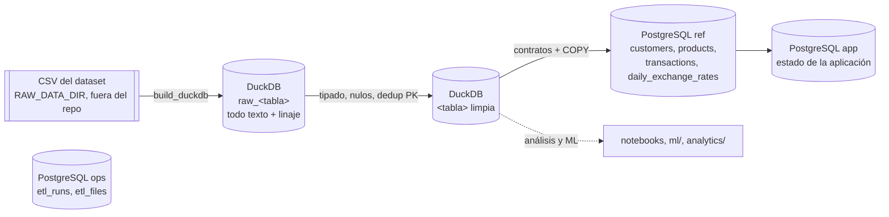

# PostgreSQL: esquema, carga y linaje

Estado: **[Decisión]** implementado en [data_pipeline/](../../data_pipeline/README.md), [backend/persistence/models.py](../../backend/persistence/models.py) y [backend/migrations/](../../backend/migrations/). Verificado el 2026-09-30 sobre **PostgreSQL 17.9** (imagen `postgres:17` de [infra/docker-compose.yml](../../infra/docker-compose.yml)).

Diagramas ER y columnas: [postgres-schema.md](postgres-schema.md), generado desde los modelos. EXPLAIN de los índices: [postgres-explain.md](postgres-explain.md).

## Recorrido de los datos



| Capa | Dónde | Qué contiene | Quién la escribe |
|---|---|---|---|
| raw | DuckDB `raw_<tabla>` | Los 13 CSV tal cual (todo VARCHAR), con `source_file`, `partition_date` e `ingest_run`. | `build_duckdb` |
| limpia | DuckDB `<tabla>` | Tipada según el diccionario, nulos y país normalizados, deduplicada por PK y enriquecida (`amount_usd_filled`, `customer_country`…). Las 13 tablas quedan aquí para análisis. | `build_duckdb` |
| servida | PostgreSQL `ref` | Solo las 4 tablas que usa la app, con tipos estrictos, PK, FK, contratos y cuarentena. | `load_postgres` |
| linaje | PostgreSQL `ops` | Una fila por corrida y una por archivo CSV leído. Nunca se trunca. | `load_postgres` |
| aplicación | PostgreSQL `app` | Sesiones, conversaciones, reclamos, handoffs, trazas. Una recarga nunca la toca. | backend |

Un solo comando hace todo el recorrido: `python -m data_pipeline.run full`. Medido: **117 s** desde los 7.671 CSV (79 s construir DuckDB, 38 s cargar PostgreSQL). En las cuatro tablas los conteos coinciden en cada capa, csv = raw = clean = ref (150.000 / 400.000 / 4.425.008 / 13.164). Las sumas de montos, `fraud_score` y coordenadas coinciden exactamente entre DuckDB y PostgreSQL.

## Esquema `ref`

Todos los montos son `NUMERIC(15,2)`, nunca float. Cada fila lleva `source_file` y `etl_run_id` (linaje hasta el CSV y la corrida que la cargó).

| Tabla | PK | FK | Notas |
|---|---|---|---|
| `customers` | `customer_id` | — | **Minimizada** (ver abajo). |
| `products` | `product_id` | `customer_id → customers` | UNIQUE (`product_id`, `customer_id`), destino de la FK compuesta. `product_number` **no** es UNIQUE (6 números repetidos, H14). `interest_rate` en `NUMERIC(7,4)`. |
| `transactions` | `transaction_id` | (`product_id`, `customer_id`) → `products`; `customer_id → customers` | La FK compuesta garantiza en la base que la transacción es del **mismo** cliente dueño del producto. `fraud_score` en `NUMERIC(5,2)`, coordenadas en `NUMERIC(10,7)`, `amount_usd_filled` agregado. |
| `daily_exchange_rates` | (`date`, `source_currency`, `target_currency`) | — | Tasas en `NUMERIC(20,10)` (hay tasas de 0,000245). |
| `rejected_rows` | `rejected_id` | — | Cuarentena: tabla, PK, partición, regla que falló, detalle y la fila completa en JSONB. |
| `demo_customers` | `customer_id` | `→ customers` | Clientes de demo por escenario (ver [Subconjunto de clientes](#subconjunto-de-clientes)). |

### Minimización de `ref.customers`

**[Decisión]** Solo se cargan: `customer_id`, `display_name`, `country`, `segment`, `customer_status`, `detected_accent`, `registration_date` y `last_updated`.

- `segment` y `country` se mantienen: el reto pide comparar resultados por segmento de cliente autorizado, y país/idioma para el análisis de disparidades.
- **Nombre visible:** `display_name` = nombre de pila + inicial del apellido ("Samuel Andrés D."). Se prefirió a un alias generado porque el selector de demo y el handoff muestran algo reconocible sin exponer el nombre completo. Se deriva en el contrato ([customers.yaml](../../data_pipeline/contracts/customers.yaml)); `first_name` y `last_name` no llegan a PostgreSQL.
- No se cargan: documento, email, teléfonos, dirección, ciudad, estado, código postal, fecha de nacimiento, género, `credit_score`, ingresos, ocupación, estado civil ni educación. Siguen en DuckDB para análisis.

### Zona horaria

**[Supuesto]** (P-29). Los timestamps del dataset no traen zona. Se guardan como `TIMESTAMP` (sin zona), tal como vienen.

**Hallazgo H16** ([quality-report.md](quality-report.md)): en las 4.425.008 transacciones, `transaction_date` cae **6–30 h después** de `process_date`, igual en los tres países. Es contraintuitivo: lo normal es procesar después de ocurrir. Encaja con timestamps en UTC y `process_date` como día hábil en UTC−6, aplicado igual a todos los países (probable regla del generador), así que no se convierte a `TIMESTAMPTZ`.

Consecuencias:

| Uso | Columna | Por qué |
|---|---|---|
| Fechas relativas del cliente ("ayer", "el martes", "la semana pasada") | `transaction_date` | Es cuando ocurrió el cargo que el cliente vio. |
| Particiones, carga incremental, `ops.etl_runs.data_as_of` | `process_date` | Es la partición del archivo de origen. |
| Aviso de frescura al cliente ("datos hasta…") | máximo `transaction_date` cargado (`ops.etl_runs.max_transaction_date`) | `data_as_of` iría hasta 30 h por detrás de la última transacción visible. |

Medido: `data_as_of` = 2026-06-17, `max_transaction_date` = 2026-06-18 05:59:41. La regla de contrato `transaction_date_offset` (advertencia) avisa si una carga nueva rompe el patrón.

Los timestamps de `app` y `ops` los genera el sistema: `TIMESTAMPTZ` en UTC (el contenedor corre con `timezone=UTC`).

### Contratos, cuarentena y umbral

Antes de escribir nada, cada fila pasa los contratos de [data_pipeline/contracts/](../../data_pipeline/contracts/README.md) (un YAML por tabla: columnas, tipos, dominios, rangos, unicidad e integridad referencial). Cada regla es **bloqueante** o de **advertencia**:

- **Bloqueante:** la fila va a `ref.rejected_rows` con `reason` = id de la regla. Por ejemplo `transaction_customer_product_mismatch`, `transaction_currency_domain`, `process_date_partition_mismatch` o `transactions_amount_not_null`.
- **Advertencia:** se carga y se cuenta en `ops.etl_runs.counts -> 'contract_warnings'`.

Si una tabla supera **0,1 %** de rechazos, la corrida se detiene sin tocar `ref` y queda como `failed`.

**Medido en el dataset completo (antes de cargar):**

| Control | Filas | Total |
|---|---|---|
| (a) transacciones con `product_id` inexistente | 0 | 4.425.008 |
| (b) productos sin cliente | 0 | 400.000 |
| (c) transacciones cuyo `customer_id` no es el dueño del producto | 0 | 4.425.008 |
| Rechazos por reglas bloqueantes | 0 | — |
| Advertencias | `product_number_unique`: 12 filas | 400.000 |

### Consistencia de `app` al final de cada corrida

Como `app` no tiene FK hacia `ref`, al final de **cada** corrida (completa, incremental o `noop`) se cuentan las filas de `app` que apuntan a IDs inexistentes en `ref`. El resultado queda en `ops.etl_runs.app_orphans`:

- `dispute_cases_transaction`: reclamo cuya (`transaction_id`, `customer_id`) no existe en `ref.transactions`.
- `handoffs_customer`: handoff de un cliente que no está en `ref.customers`.
- `card_status_overrides_product`: bloqueo cuyo (`product_id`, `customer_id`) no existe en `ref.products`.

Si alguno es > 0, la corrida queda como **`warning`**, no como `failed`: los datos de `ref` sí se cargaron. Pasa, por ejemplo, al cargar un subconjunto de clientes distinto del que usó la demo.

## Índices

Cada índice se justifica con la consulta de una tool y se verifica con EXPLAIN ANALYZE en [postgres-explain.md](postgres-explain.md) (`python -m data_pipeline.quality.explain_indexes`). Se mide el cliente con más transacciones (150), con caché caliente. Cada variante de índices se prueba dentro de una transacción con ROLLBACK.

| Índice | Consulta que lo usa | Con índice | Sin él |
|---|---|---|---|
| `transactions (customer_id, transaction_date DESC)` | `search_transactions`: ventana de fechas del cliente, más recientes primero; también la búsqueda por monto | 0,011 ms | 97 ms (Seq Scan) |
| `transactions (product_id)` | historial de una tarjeta (`lock_card`), soporte de la FK | 0,015 ms | 92 ms (Seq Scan) |
| `products (customer_id)` | tarjetas del cliente (`get_card_status`, `lock_card`) | 0,012 ms | 12 ms (Seq Scan) |
| `transactions (process_date)` | carga incremental: `DELETE` de una partición (~4.000 filas) | 1,1 ms | 180 ms (Seq Scan) |

**`transactions (customer_id, amount)` se eliminó** (migración 0002). La búsqueda por monto ±10 % tarda:

- 0,054 ms con el índice por fecha;
- 0,009 ms con el índice por monto (creado temporalmente para medirlo);
- 157 ms sin ningún índice por cliente.

Un cliente tiene como mucho 150 transacciones, así que el índice por fecha ya acota la búsqueda. Un índice más encarece cada carga incremental y no aporta una diferencia perceptible.

**Tiempos de las tools con los privilegios del backend** (`SET ROLE app_rw`; [test_tool_queries.py](../../data_pipeline/tests/test_tool_queries.py)): 180 clientes deterministas, dataset completo cargado en la base de prueba `bank_perf_test`, latencia vista desde el cliente.

| Consulta | p50 | p95 | máx |
|---|---|---|---|
| `search_transactions` (ventana 90 d) | 0,26 ms | 0,33 ms | 0,7 ms |
| `search_transactions` (monto ±10 %) | 0,26 ms | 0,34 ms | 0,8 ms |
| `get_transaction` | 0,22 ms | 0,32 ms | 1,4 ms |
| `fraud_risk` (lee `fraud_score`) | 0,23 ms | 0,28 ms | 1,1 ms |
| `get_existing_case` | 0,23 ms | 0,30 ms | 1,3 ms |
| tarjetas del cliente | 0,24 ms | 0,31 ms | 1,2 ms |
| `get_card_status` (vista efectiva) | 0,25 ms | 0,30 ms | 1,6 ms |
| historial de la tarjeta | 0,26 ms | 0,30 ms | 1,6 ms |

El test exige p95 < 25 ms.

La tabla completa de índices de `ref`, `app` y `ops`, cada uno con la consulta que lo justifica, está en [postgres-schema.md](postgres-schema.md#índices-y-consulta-que-los-justifica).

## Política de frescura

El dataset es estático, pero la política define cómo se comportaría con entregas diarias y qué ve el cliente.

| Qué | Cómo se calcula | Para qué |
|---|---|---|
| `data_as_of` | máx. `process_date` cargado (`ops.etl_runs.data_as_of`) | Particiones completas cargadas; uso interno: linaje, alertas, incremental. |
| `max_transaction_date` | máx. `transaction_date` cargado (`ops.etl_runs.max_transaction_date`) | **Aviso al cliente**: "Movimientos disponibles hasta el {max_transaction_date}". No se usa `data_as_of`, porque por H16 va hasta 30 h por detrás de la última transacción visible. |
| Última carga válida | corrida más reciente con `status` en (`success`, `warning`, `noop`) | Saber desde cuándo no se actualizan los datos. |

**[Supuesto]** (P-30), sin implementar porque no hay scheduler:

- **Horario:** una incremental diaria a las 07:00 UTC. Por H16, la última transacción de la partición D puede tener `transaction_date` hasta D+1 06:00, así que la partición D se da por completa después de esa hora. Un archivo que llega tarde lo recoge la siguiente corrida: `pending_files` compara contra `ops.etl_files`.
- **Datos viejos:** más de 26 h sin una carga válida, o `data_as_of` anterior a hoy − 2 días. En ese caso el chat agrega "los datos pueden estar desactualizados" y la operación recibe una alerta.
- **Demo:** con el dataset estático, "hoy" es `REFERENCE_DATE` (P-08). Medido: `data_as_of` = 2026-06-17 y `max_transaction_date` = 2026-06-18 05:59:41.

## Esquema `ops` (linaje)

| Tabla | Una fila por | Columnas clave |
|---|---|---|
| `etl_runs` | corrida | Ver la lista debajo. |
| `etl_files` | archivo CSV leído en la corrida | `source_file`, `partition_date`, `sha256`, `size_bytes`, `rows`, `rejected_rows` (líneas mal formadas), `action` (loaded/new/changed). |

Columnas clave de `etl_runs`:

- Corrida: `mode` (full/incremental), `status` (running/success/**warning**/failed/noop), `git_commit`, `git_dirty`, `duckdb_sha256`, `error`.
- Frescura: `data_as_of` (máx. `process_date`) y `max_transaction_date`.
- Alcance de clientes: `customer_scope`, `customer_rule`, `customer_seed`, `customer_list_sha256`.
- Resultados: `counts` (filas por tabla en cada capa csv → raw → clean → ref, huérfanos, rechazos por regla, advertencias de contrato), `app_orphans`, `partitions_replaced`.

`ops` vive aparte de `ref` para que ni un TRUNCATE ni un cambio de tablas en `ref` borren el linaje. `etl_files` se escribe en la **misma transacción** que los datos: si un archivo figura ahí, sus filas están en `ref`.

## Esquema `app`

Nueve tablas y una vista, creadas por Alembic. **No hay FK de `app` hacia `ref`**: `customer_id`, `transaction_id` y `product_id` son referencias lógicas. Los tools validan la pertenencia contra `ref` al leer, y el chequeo `app_orphans` las cuenta en cada corrida.

| Tabla | Para qué | Restricciones |
|---|---|---|
| `sessions` | sesión de prueba (`customer` o `agent`) | se guarda el hash del token, no el token |
| `conversations` | estado de la máquina | `clarification_round` entre 0 y 3 |
| `turns` | mensajes, acciones y bloques | UNIQUE (`conversation_id`, `seq`) |
| `confirmation_tokens` | token de un solo uso por acción | hash UNIQUE, `consumed_at` |
| `idempotency_keys` | respuesta guardada por (`session_id`, clave) | PK compuesta = clave única; `request_hash`, `status_code`, `response`; `expires_at` indexado |
| `dispute_cases` | reclamos | Ver la lista debajo. |
| `card_status_overrides` | bloqueos de `lock_card` | índice (`product_id`, `created_at DESC`) |
| `handoffs` | escalamientos ([handoff-schema.md](../handoff-schema.md)) | CHECK de `reason_code`, `priority`, `status` |
| `traces` | pasos de cada turno | UNIQUE (`turn_id`, `step_seq`) |
| vista `card_status_effective` | estado efectivo de una tarjeta | override más reciente o, si no hay, `ref.products.product_status` |

Restricciones de `dispute_cases`:

- **Índice único parcial** (`customer_id`, `transaction_id`) `WHERE status IN ('registrado', 'en_revision')`. Es R3: un solo reclamo abierto por transacción; los cerrados no bloquean uno nuevo.
- `idempotency_key` UNIQUE y `confirmation_token_id` UNIQUE: un reintento no crea un segundo reclamo.
- `confirmed_at` NOT NULL, con CHECK `confirmed_at <= created_at`.
- `created_at` y `status`.

## Roles

**[Decisión]** El backend y la consola nunca usan el superusuario ni el dueño de los esquemas.

| Rol | Login (`.env`) | `ref` | `app` | `ops` | Uso |
|---|---|---|---|---|---|
| dueño (`POSTGRES_USER`) | `ADMIN_DATABASE_URL` | todo | todo | todo | solo ETL y Alembic |
| `app_rw` | `APP_DB_USER` → `DATABASE_URL` | SELECT | SELECT, INSERT, UPDATE, DELETE | SELECT (frescura) | backend |
| `app_ro` | `CONSOLE_DB_USER` → `CONSOLE_DATABASE_URL` | SELECT | SELECT | SELECT (linaje) | consola del banco |

- Los grupos y los GRANT (incluidos `ALTER DEFAULT PRIVILEGES` para tablas futuras) están en la migración 0002.
- Los usuarios de login los crea [infra/postgres/init/01-roles.sh](../../infra/postgres/init/01-roles.sh) al inicializar el volumen, con contraseñas de `.env`.
- [test_roles.py](../../data_pipeline/tests/test_roles.py) prueba varias cosas:
  - `app_rw` no puede escribir, actualizar ni truncar `ref`, borrar `ops` ni crear tablas;
  - `app_ro` no puede escribir `app`;
  - ambos leen `ref`, `app` y `ops`;
  - el login del backend no es superusuario ni dueño de ningún esquema.

**Pendiente (opcional):** Row-Level Security por `customer_id` en `app`. Hoy el aislamiento por cliente lo garantizan los tools (filtro por el `customer_id` de la sesión) y, en `ref`, la FK compuesta.

## Carga completa

`TRUNCATE` + `COPY` en una sola transacción:

1. Se sueltan FK, UNIQUE e índices secundarios de `ref`. Sus definiciones se leen del catálogo para recrearlos idénticos.
2. `TRUNCATE` y `COPY` de las cuatro tablas.
3. Se recrean índices y constraints. Las FK se validan en bloque.
4. Se registran los archivos en `ops.etl_files`, `COMMIT` y `ANALYZE`.

Mientras dura la carga (~35 s), las lecturas de `ref` esperan (el TRUNCATE toma un lock exclusivo) y después ven los datos nuevos o, si falla, los anteriores.

**Idempotente:** dos cargas completas seguidas dejan `ref` idéntico, salvo `etl_run_id`, con los mismos conteos y el mismo `customer_list_sha256` ([test_full_load.py](../../data_pipeline/tests/test_full_load.py)).

**Nunca toca `app`:** el test crea filas en las 9 tablas de `app`, recarga `ref` y verifica que siguen todas. El bloqueo de tarjeta sigue mandando sobre `ref.products`.

## Carga incremental por `process_date`

`python -m data_pipeline.run incremental`

1. **DuckDB:** detecta archivos nuevos o con hash distinto (contra `ingest_log`). Los lee a `raw_<tabla>` (un archivo re-entregado reemplaza sus filas) y reconstruye en la tabla limpia **solo** sus particiones. Dentro de una partición, si una PK llega dos veces gana la última ingesta.
2. **PostgreSQL:** los pendientes son los archivos de `ingest_log` que `ops.etl_files` no tiene con ese hash. Si una carga a PostgreSQL falló después de actualizar DuckDB, la siguiente corrida la retoma.
3. **Una transacción:**
   - contratos validados contra lo que ya está en PostgreSQL;
   - `DELETE` de esas particiones en `ref.transactions` y `ref.rejected_rows`;
   - `COPY` de las filas nuevas;
   - registro en `ops.etl_files`.
4. **Sin archivos nuevos no toca nada:** la corrida queda como `noop` (4,5 s sobre el dataset completo, casi todo en hashear los 7.671 CSV).
5. **Archivos sin partición:** un cambio en customers, products o tasas exige una carga completa (`NeedsFullReload`).

Prueba: [test_incremental.py](../../data_pipeline/tests/test_incremental.py), con el fixture sintético [fixtures/incremental/](../../data_pipeline/fixtures/README.md). Tiene un día nuevo, una llegada tardía y una fila corregida:

- **Solo se reemplazan las particiones afectadas:** las filas del día no afectado conservan su `xmin`.
- **Es idempotente.**
- **La cuarentena funciona:** una transacción con producto de otro cliente detiene la corrida o, con un umbral permisivo, va a `rejected_rows`.

## Subconjunto de clientes

`python -m data_pipeline.run full --customers-sample N` (o `--customers archivo`, no versionado). **[Decisión]** (cierra P-06): la carga completa es el valor por defecto; el subconjunto es para despliegues chicos.

- **Determinista y demostrable.** No se versiona ninguna lista de IDs (P-04); se versiona la regla ([demo_customers.py](../../data_pipeline/etl/demo_customers.py), `demo_customers v1`). Cada corrida guarda en `ops.etl_runs` la regla (`customer_rule`, con `reference_date`), la semilla (`customer_seed`) y el sha256 de los `customer_id` cargados (`customer_list_sha256`). Dos despliegues con N = 200 y semilla 42 dieron el mismo hash (`3cf694bb…`). La carga completa también guarda el hash de sus 150.000 clientes.
- **Consistente.** Incluye todos los productos y todas las transacciones de esos clientes. Con N = 200: 596 productos y 6.872 transacciones, iguales a DuckDB, y FK válidas.
- **Cubre los escenarios** (ventana de 60 días antes de `REFERENCE_DATE`, o del último `process_date`):
  - `cargo_claro`: cargo Approved de los últimos 30 días sin otro de monto ±10 %.
  - `cargos_parecidos`: dos o más cargos con montos a ±10 %.
  - `pendiente`: cargo Pending.
  - `revertido`: cargo Reversed.
  - `fraude_alto`: `fraud_score` ≥ 80.
  - `fuera_de_plazo`: cargo de hace 61–120 días.

`ref.demo_customers` guarda 2 clientes por escenario (también en la carga completa) para `GET /api/demo/customers`.

## Cómo correrlo

```bash
cp .env.example .env    # completar POSTGRES_*, APP_DB_*, CONSOLE_DB_*, *_DATABASE_URL, DUCKDB_PATH, RAW_DATA_DIR
docker compose --env-file .env -f infra/docker-compose.yml up -d        # PostgreSQL 17 + roles
.venv/bin/pip install -r requirements.txt
.venv/bin/python -m data_pipeline.run full            # CSV → DuckDB → migraciones → PostgreSQL
.venv/bin/python -m data_pipeline.run incremental     # solo archivos nuevos o modificados
.venv/bin/python -m data_pipeline.run check           # conteos de huérfanos sin cargar
docker compose --env-file .env -f infra/docker-compose.yml exec postgres createdb -U "$POSTGRES_USER" bank_test
.venv/bin/pytest data_pipeline/tests -v                # 31 pruebas, solo sobre bases *_test (ver abajo)
.venv/bin/python -m data_pipeline.quality.explain_indexes   # regenera postgres-explain.md
.venv/bin/python -m data_pipeline.quality.schema_doc        # regenera postgres-schema.md
```

Las migraciones también se pueden correr solas: `.venv/bin/alembic -c backend/alembic.ini upgrade head` (usa `ADMIN_DATABASE_URL`).

## Pruebas y aislamiento

- **Solo bases `_test`:** toda conexión de prueba pasa por un guardia que **hace fallar** la sesión si la base no termina en `_test` ([conftest.py](../../data_pipeline/tests/conftest.py), [test_guard.py](../../data_pipeline/tests/test_guard.py)). Ninguna prueba usa `DATABASE_URL` ni `ADMIN_DATABASE_URL`.
- **Base limpia:** al iniciar cada corrida de pytest, `bank_test` se vacía y se migra. Cada prueba que usa el fixture la vacía otra vez antes de empezar, así que no se acumulan filas de `app` con IDs `FXT-`.
- **Rendimiento:** la prueba de tiempos usa su propia base, `bank_perf_test` (`PERF_TEST_DATABASE_URL`). La carga desde la DuckDB local la primera vez (~40 s) y luego la reutiliza.
- **Login del backend:** se prueba con `APP_DB_USER` contra `bank_test`, no contra la base principal.

## Limitaciones

- **Bloqueo de lecturas:** la carga completa bloquea las lecturas de `ref` mientras dura (~35 s). Para cero bloqueo haría falta cargar en tablas nuevas e intercambiarlas (swap); no se hizo porque las migraciones de Alembic son la fuente de los DDL.
- **Alcance de la incremental:** solo aplica a tablas particionadas; `customers`, `products` y tasas se recargan completas.
- **Borrados:** un archivo borrado del origen no borra sus filas (no hay detección de borrados).
- **Evolución de esquema:** una columna nueva en un CSV se absorbe en DuckDB (`UNION ALL BY NAME`), pero `ref` solo carga las columnas del modelo y del contrato; una columna nueva requiere migración y nueva versión del contrato.
- **Atomicidad de la incremental:** actualiza DuckDB en sitio (no es atómica como la completa). Si falla a mitad, la transacción de DuckDB se revierte; si falla PostgreSQL, la siguiente corrida retoma desde `ops.etl_files`.
- **Credenciales:** los usuarios de login se crean solo al inicializar el volumen. Cambiar sus contraseñas requiere `ALTER ROLE` o recrear el volumen.
