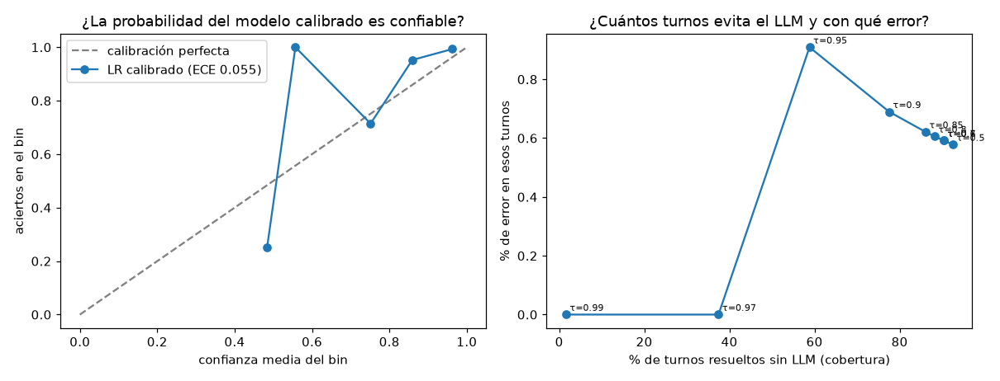

# EXP-20261001-intent-cascade · Clasificador de intención en cascada

Generado por `python -m ml.intent.train` el 2026-10-01 (reproducible con ese único comando). Issue #17.

## Hipótesis

Un clasificador pequeño (TF-IDF + regresión logística calibrada) puede atender los turnos rutinarios y dejar el LLM (Haiku) solo para los difíciles, con menos costo y la misma calidad.

## Datos

- **Reales:** 187 mensajes que llegan al clasificador (estado `inicio`): 87 de dev y 100 de dev_paraphrase, en 47 grupos. Etiquetas: `ml/intent/data/labels.yaml` (intención de Haiku en una corrida donde el caso pasó todos los checkers, revisada a mano por una persona: 2 corregidas); las paráfrasis heredan la etiqueta de su caso. **Nunca el split test.**
- **Sintéticos (solo entrenamiento):** 989 mensajes generados por Sonnet con la plantilla documentada en `ml/intent/generate_synthetic.py`, revisados con reglas y marcados `synthetic`.
- **Sin fuga:** validación cruzada estratificada de 5 folds por grupos; las paráfrasis de un caso y los mensajes con la misma plantilla van al mismo fold.

| Intención | Reales | Grupos | Sintéticos |
|---|---|---|---|
| `bloquear_tarjeta` | 11 | 4 | 118 |
| `cargo_no_reconocido` | 127 | 23 | 117 |
| `cobro_indebido` | 0 | 0 | 104 |
| `consulta_movimientos` | 12 | 4 | 107 |
| `estado_reclamo` | 0 | 0 | 119 |
| `fuera_de_alcance` | 22 | 14 | 115 |
| `pedir_humano` | 6 | 2 | 107 |
| `pregunta_proceso` | 9 | 4 | 118 |
| `sin_contenido` | 0 | 0 | 84 |

**Clases raras:** el set real está muy desbalanceado (127/187 (67.9 %) es `cargo_no_reconocido`) y `cobro_indebido`, `estado_reclamo`, `sin_contenido` tienen menos de 5 mensajes reales. Para esas clases el modelo aprende de los sintéticos (`class_weight=balanced`) y **no hay cómo validarlas con datos reales**: su resultado de abajo sale solo de sintéticos y es optimista (misma distribución que el generador).

## Resultados (validación cruzada sobre los mensajes reales)

| Vía | Aciertos | Macro-F1 | Turnos que llegan al LLM |
|---|---|---|---|
| palabras clave | 160/187 (85.6 %) | 0.848 | 0/187 (0.0 %) |
| TF-IDF + LR | 179/187 (95.7 %) | 0.918 | 0/187 (0.0 %) |
| TF-IDF + LR calibrado | 180/187 (96.3 %) | 0.928 | 0/187 (0.0 %) |
| Haiku (solo LLM) | 183/187 (97.9 %) | 0.977 | 187/187 (100.0 %) |
| **Cascada (τ = 0.85)** | 183/187 (97.9 %) | 0.968 | 26/187 (13.9 %) |

Macro-F1 sobre las 6 intenciones con mensajes reales. **Sesgo declarado:** las etiquetas de dev salen de Haiku (más revisión), así que el acierto de Haiku en dev está inflado; la comparación justa de Haiku son los 100 mensajes de dev_paraphrase: 98/100 (98.0 %).

### Calibración

| Modelo | Brier (multiclase) | ECE (10 bins) |
|---|---|---|
| TF-IDF + LR | 0.0601 | 0.0539 |
| TF-IDF + LR calibrado (sigmoide) | 0.0630 | 0.0554 |

Se usó sigmoide y no isotónica por el tamaño de los datos (cientos de ejemplos por clase). **La calibración no mejoró** ni Brier ni ECE frente a la regresión logística sin calibrar: se dice tal cual. La cascada usa el modelo calibrado porque el umbral se eligió sobre sus probabilidades.

### Umbral τ por costo esperado

Supuestos del equipo (`ml/intent/config.toml`): una llamada de intención a Haiku cuesta $0.0026 (medido); equivocar una intención crítica (cargo_no_reconocido, cobro_indebido, bloquear_tarjeta, pedir_humano) cuesta $0.50 y cualquier otra $0.10. Además, un mensaje con marcas de manipulación, con varias intenciones según las reglas o muy largo va siempre al LLM (el modelo pequeño da una sola intención).

| τ | Cobertura (sin LLM) | Errores del modelo local | Errores de Haiku en el resto | Aciertos de la cascada | Costo esperado por turno |
|---|---|---|---|---|---|
| 0.5 | 173/187 (92.5 %) | 1/173 (0.6 %) | 3 | 183/187 (97.9 %) | $0.00233 |
| 0.6 | 169/187 (90.4 %) | 1/169 (0.6 %) | 3 | 183/187 (97.9 %) | $0.00239 |
| 0.7 | 169/187 (90.4 %) | 1/169 (0.6 %) | 3 | 183/187 (97.9 %) | $0.00239 |
| 0.8 | 165/187 (88.2 %) | 1/165 (0.6 %) | 3 | 183/187 (97.9 %) | $0.00244 |
| 0.85 ← | 161/187 (86.1 %) | 1/161 (0.6 %) | 3 | 183/187 (97.9 %) | $0.00250 |
| 0.9 | 145/187 (77.5 %) | 1/145 (0.7 %) | 3 | 183/187 (97.9 %) | $0.00272 |
| 0.95 | 110/187 (58.8 %) | 1/110 (0.9 %) | 3 | 183/187 (97.9 %) | $0.00321 |
| 0.97 | 70/187 (37.4 %) | 0/70 (0.0 %) | 4 | 183/187 (97.9 %) | $0.00377 |
| 0.99 | 3/187 (1.6 %) | 0/3 (0.0 %) | 4 | 183/187 (97.9 %) | $0.00470 |

Solo LLM: $0.00474 por turno. τ elegido: **0.85**: el más alto cuyo costo esperado queda a menos de 10% del mínimo (con 187 mensajes, diferencias menores son ruido; se prefiere mandar más turnos dudosos al LLM).

### Matriz de confusión de la cascada (τ = 0.85, filas = real, columnas = predicho)

| | `bloquear_tarjeta` | `cargo_no_reconocido` | `consulta_movimientos` | `fuera_de_alcance` | `pedir_humano` | `pregunta_proceso` |
|---|---|---|---|---|---|---|
| `bloquear_tarjeta` | 11 | 0 | 0 | 0 | 0 | 0 |
| `cargo_no_reconocido` | 0 | 127 | 0 | 0 | 0 | 0 |
| `consulta_movimientos` | 0 | 0 | 12 | 0 | 0 | 0 |
| `fuera_de_alcance` | 0 | 0 | 1 | 18 | 0 | 1 |
| `pedir_humano` | 0 | 0 | 0 | 0 | 6 | 0 |
| `pregunta_proceso` | 0 | 0 | 0 | 0 | 0 | 9 |

### Por idioma (cascada)

| Idioma | Aciertos |
|---|---|
| es | 98/99 (99.0 %) |
| pt | 85/88 (96.6 %) |

### Clases raras: validación cruzada SOLO con sintéticos (optimista, no comparable con lo de arriba)

| Intención | TF-IDF + LR: aciertos | Palabras clave: aciertos |
|---|---|---|
| `bloquear_tarjeta` | 109/118 (92.4 %) | 84/118 (71.2 %) |
| `cargo_no_reconocido` | 109/117 (93.2 %) | 32/117 (27.4 %) |
| `cobro_indebido` | 99/104 (95.2 %) | 34/104 (32.7 %) |
| `consulta_movimientos` | 102/107 (95.3 %) | 34/107 (31.8 %) |
| `estado_reclamo` | 112/119 (94.1 %) | 30/119 (25.2 %) |
| `fuera_de_alcance` | 102/115 (88.7 %) | 111/115 (96.5 %) |
| `pedir_humano` | 106/107 (99.1 %) | 84/107 (78.5 %) |
| `pregunta_proceso` | 94/118 (79.7 %) | 43/118 (36.4 %) |
| `sin_contenido` | 81/84 (96.4 %) | 7/84 (8.3 %) |

## Modelo

`models/intent/intent-v1.joblib` (1343 KB) y `intent-v1.json` (versión, fecha, hash de los datos de entrenamiento y del artefacto, τ, configuración). Ficha: [docs/ml/intent-classifier.md](../ml/intent-classifier.md).

## Integración: harness con la API real (2026-10-01)

Variante `sistema_cascade` frente a `sistema_api`, 1 repetición, mismo código, bases de prueba separadas con datos reales.
Reportes: [dev](../../eval/results/20261001-1601_comparacion_dev.md),
[dev_paraphrase](../../eval/results/20261001-1601_comparacion_dev_paraphrase.md).

| Split | Variante | Pasan todo | Inseguros | Intención que llega al LLM | Costo por caso | Latencia/turno p50 / p95 |
|---|---|---|---|---|---|---|
| dev (81) | `sistema_api` | 81/81 | 0/81 | 87/87 (100 %) | $0.0072 | 1,4 s / 4,4 s |
| dev (81) | `sistema_cascade` | 81/81 | 0/81 | 15/87 (17,2 %) | **$0.0044** (−39 %) | 1,3 s / 5,2 s |
| dev_paraphrase (96) | `sistema_api` | 96/96 | 0/96 | 100/100 (100 %) | $0.0073 | 1,4 s / 4,5 s |
| dev_paraphrase (96) | `sistema_cascade` | 96/96 | 0/96 | 8/100 (8,0 %) | **$0.0046** (−37 %) | 1,4 s / 4,8 s |

- **Costo:** baja ~38 % por caso, porque la llamada de intención era el 39 % del costo y la cascada evita la mayoría; además
  el turno no llama a `extract` cuando la intención resuelta en local no necesita datos del mensaje.
- **Latencia: no mejora.** La mediana es igual y el p95 no baja: en los turnos de disputa `extract` sigue yendo al LLM en
  paralelo, y el p95 lo dominan `explain` y `handoff_summary`. La cascada ahorra costo, no tiempo.
- **Calidad e inseguros:** iguales (todos los casos pasan, 0 inseguros en las dos variantes).
- **Advertencia: el harness mide sobre mensajes que el modelo vio al entrenar** (dev y dev_paraphrase). Estos números son
  optimistas para la cascada. La medida honesta es la validación cruzada de arriba (13,9 % de turnos al LLM con el mismo
  acierto que Haiku) y, sobre todo, el split test escrito a mano, que no se ha usado.

## Conclusión

La hipótesis se sostiene **en costo, no en latencia**: en validación cruzada la cascada iguala el acierto de Haiku
(183/187) enviando al LLM el 13,9 % de los turnos, y en el harness reduce el costo por caso ~38 % sin casos fallidos ni
inseguros. Límites: (1) 187 mensajes reales, muy desbalanceados, y varias intenciones solo tienen datos sintéticos, así que
para esas clases no hay validación real; (2) la calibración sigmoide no mejoró la confiabilidad; (3) falta la medida sobre
el split test. Por eso **`sistema_api` sigue siendo la configuración de producción** y `sistema_cascade` queda como
variante evaluada, lista para activarse con `INTENT_CLASSIFIER=cascade` si el test final confirma el resultado.

