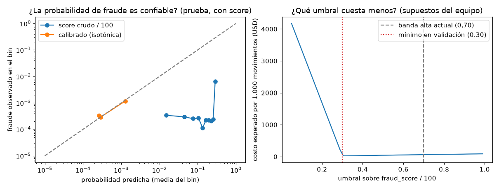

# EXP-20261001-risk-calibration · Riesgo: calibración y política

Generado por `python -m ml.fraud_risk.experiment` el 2026-10-01 (reproducible con ese comando sobre `data/bank.duckdb`). Issue #26.

## Hipótesis

1. Calibrar `fraud_score` (isotónica) da una probabilidad de fraude confiable y un umbral elegido por costo, mejor que las bandas fijas del score crudo.
2. Un modelo simple con variables del movimiento puede dar una señal de riesgo al ~20 % de movimientos que no tienen `fraud_score`.

## Datos y partición

- Etiqueta: `transactions.is_fraud` (columna del diccionario de datos; **sintética**). 4.316/4.425.008 (0.10 %) de los movimientos.
- **Partición temporal** por `transaction_date`: entrenamiento hasta 2025-05-20, validación hasta 2025-11-12 (elegir umbrales), prueba después. Prueba: 885.002 movimientos, 782 fraudes.
- Sin `fraud_score`: 885.157/4.425.008 (20.00 %). En prueba: 176.948/885.002 (19.99 %), con 162 fraudes.
- **¿La falta de score dice algo?** No: tasa de fraude 0.097 % con score y 0.101 % sin score, en todo el dataset. La ausencia no es una señal; se trata como riesgo desconocido, no como riesgo bajo.
- Sin atributos demográficos del cliente. Variables del modelo simple: `amount_usd_filled`, `hora`, `dow`, `channel`, `transaction_type`, `transaction_category`, `merchant_category`, `transaction_country`, `currency`, `transaction_status`, `response_code`.

**Límite importante:** se mide sobre TODOS los movimientos, no sobre los que un cliente disputa. La política usa el riesgo solo en movimientos disputados, donde la proporción de fraude es mayor; los umbrales son un punto de partida.

## Movimientos con score (prueba)

| Señal | PR-AUC | ROC-AUC | Brier |
|---|---|---|---|
| `fraud_score / 100` crudo | 0.7208 | 0.8535 | 0.030270 |
| Calibrado (isotónica) | 0.7202 | 0.8497 | 0.000246 |

La isotónica es monótona: no cambia el orden (PR-AUC y ROC-AUC casi iguales; las diferencias vienen de empates). Lo que cambia es la **confiabilidad**: el score crudo dividido por 100 no es una probabilidad (Brier mucho peor).

Supuestos de costo del equipo (`ml/fraud_risk/config.toml`): un fraude no priorizado cuesta $100; un movimiento legítimo enviado al equipo de fraude cuesta $5. Umbrales elegidos en validación, medidos en prueba:

| Opción | Enviados con prioridad | Fraudes detectados (recall) | Precisión | Costo esperado por 1.000 |
|---|---|---|---|---|
| Score crudo, banda alta actual (≥ 0,70) | 182/708.054 (0.03 %) | 182/620 (29.35 %) | 182/182 (100.00 %) | $61.86 |
| Score crudo, umbral por costo (≥ 0.30) | 1.082/708.054 (0.15 %) | 446/620 (71.94 %) | 446/1.082 (41.22 %) | $29.07 |
| Score calibrado (isotónica), umbral por costo (p ≥ 0.5003) | 446/708.054 (0.06 %) | 446/620 (71.94 %) | 446/446 (100.00 %) | $24.57 |
| Nadie con prioridad (referencia) | 0/708.054 (0.00 %) | 0/620 (0.00 %) | — | $87.56 |

## Movimientos sin score (prueba)

Prevalencia de fraude: 0.092 % (una señal al azar tiene PR-AUC ≈ 0.0009).

| Señal | PR-AUC | ROC-AUC | Brier |
|---|---|---|---|
| Modelo simple (LightGBM, 1 árboles) | 0.0010 | 0.5186 | 0.000915 |

| Opción | Enviados con prioridad | Fraudes detectados (recall) | Precisión | Costo esperado por 1.000 |
|---|---|---|---|---|
| Modelo simple (LightGBM), umbral por costo (p ≥ 0.0018) | 19/176.948 (0.01 %) | 0/162 (0.00 %) | 0/19 (0.00 %) | $92.09 |
| Hoy: banda `desconocido`, nadie con prioridad por riesgo | 0/176.948 (0.00 %) | 0/162 (0.00 %) | — | $91.55 |

Variables más usadas por el modelo: `amount_usd_filled` (12), `hora` (10), `currency` (4), `merchant_category` (2), `transaction_status` (2). Sobre los movimientos que SÍ tienen score, el modelo simple logra PR-AUC 0.0010 frente a 0.7208 del score: el score sigue siendo la señal.

## Conclusión

1. **Calibración: sí.** El score calibrado es una probabilidad utilizable (Brier 0.000246 frente a 0.030270) y el umbral por costo detecta 446/620 (71.94 %) de los fraudes con score frente a 182/620 (29.35 %) de la banda alta actual, con un costo esperado de $24.57 frente a $61.86 por 1.000 movimientos. Bajar a ojo el umbral del score crudo también sube el recall, pero con peor precisión (446/1.082 (41.22 %)); lo que aporta la calibración es poder razonar en probabilidades y costos, no un mejor orden. En este dataset el calibrador es casi un escalón: el umbral equivale a `fraud_score` ≥ 30.0, por debajo del corte actual de 70 (y del 35 de la banda media).
2. **Modelo para movimientos sin score: no mejora lo suficiente.** PR-AUC 0.0010 frente a una prevalencia de 0.0009: las variables del movimiento casi no separan el fraude, y con el umbral de menor costo no baja el costo esperado frente a no priorizar. **No se integra**: esos movimientos siguen en la banda `desconocido`, con la regla actual (ofrecer el bloqueo; escalar si el monto es alto).
3. Todo depende de una etiqueta sintética y de costos supuestos. El riesgo solo cambia la ruta y la prioridad del caso.

